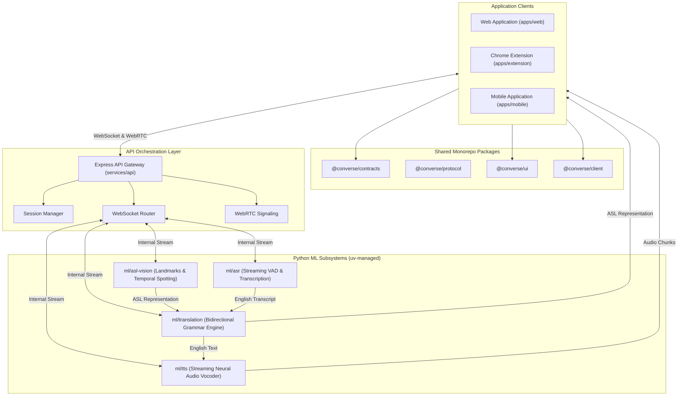
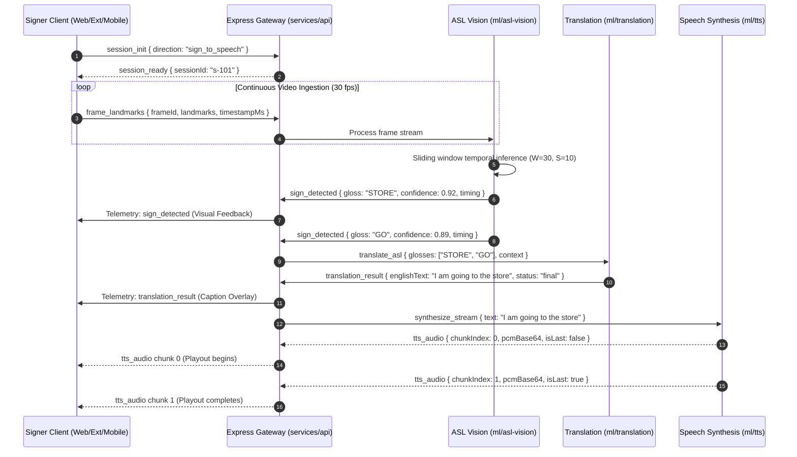
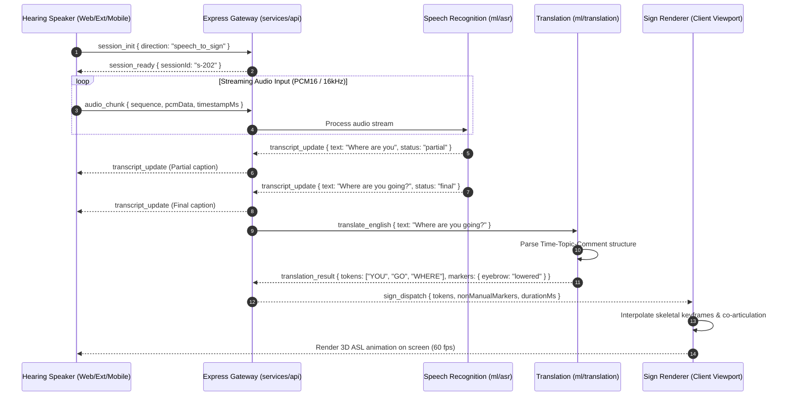

# Converse Architecture Specification

Document Status: Active Baseline
Version: 1.0.0
System: Converse Bidirectional Communication Core and Applications

---

## 1. System Scope, Purpose, and Architectural Invariants

### 1.1 Scope and Purpose
Converse is a real-time, bidirectional communication system operating between American Sign Language (ASL) and spoken English. The platform provides symmetric communication access for Deaf/Hard-of-Hearing signers and hearing non-signers across three operational surfaces:
1. Web browser workstations and laptops (`apps/web`).
2. Teleconferencing meeting software via browser extension (`apps/extension` targeting Google Meet and Zoom).
3. Mobile handheld devices for in-person split-screen dialogue and direct calls (`apps/mobile`).

### 1.2 Core Architectural Invariants
The architecture is governed by five non-negotiable invariants:

1. **Decoupled Logical vs. Deployment Boundaries**:
   Logical boundaries define conceptual transformations and contracts. Deployment boundaries define process, container, and network placement. Logical boundaries must remain immutable even when models fuse stages into a single computational graph or when client devices run stages locally.

2. **Contract-First Communication Core**:
   All communication between subsystems is mediated by typed schemas defined in `packages/contracts`. Internal model changes, weight updates, or framework substitutions must never break upstream producers or downstream consumers.

3. **Pipeline Concurrency and Streaming Execution**:
   Conversational fluency requires sub-second responsiveness. The system strictly avoids store-and-forward batch architectures. All components process continuous streams of chunks (frames, audio packets, tokens) and emit partial hypotheses followed by final commitments.

4. **Explicit Uncertainty and Error Propagation**:
   Machine learning inference produces confidence metrics. The system treats errors and low confidence as typed data values rather than unhandled exceptions. Confidence scores drive non-intrusive UI disambiguation before irreversible audio or avatar output occurs.

5. **Zero Persistent Storage for Ephemeral Media**:
   Raw video frames, intermediate landmark arrays, and raw PCM audio buffers are processed in volatile memory and immediately discarded. Media streams are never persisted to non-volatile storage without explicit user consent.

---

## 2. Conceptual Foundation: The Three Sign Stages

A central challenge in sign language computation is preventing premature coupling between computer vision primitives and linguistic translations. Converse defines three distinct conceptual stages for processing sign input:

```
[Raw Camera Video]
        │
        ▼
┌─────────────────────────────────────────────────────────────┐
│ 1. SignObservation                                          │
│ Physical and spatial measurements of the signer             │
│ (Bounding boxes, 3D hand/body keypoints, facial mesh)       │
└──────────────────────────────┬──────────────────────────────┘
                               │
                               ▼
┌─────────────────────────────────────────────────────────────┐
│ 2. SignUnderstanding                                        │
│ Spatiotemporal modeling and gesture classification          │
│ (Sliding window trajectories, sign spotting, gloss candidates)│
└──────────────────────────────┬──────────────────────────────┘
                               │
                               ▼
┌─────────────────────────────────────────────────────────────┐
│ 3. SignRepresentation                                       │
│ Machine-readable semantic and linguistic sign structure      │
│ (Structured ASL tokens, timing, non-manual markers)         │
└──────────────────────────────┬──────────────────────────────┘
                               │
                               ▼
                    [Translation Engine]
```

### 2.1 Stage Definitions

#### Stage 1: SignObservation
- **Definition**: Structured extraction of physical, geometric, and spatiotemporal measurements directly from sensor input. It captures *what the camera physically records*, not what the signer means.
- **Data Attributes**: 3D Cartesian coordinates ($x, y, z$) for 21 landmarks per hand, 33 skeletal pose landmarks, and key facial feature points (eyebrows, eye apertures, lips). Coordinates are normalized against the signer torso and shoulder span to achieve distance and scale invariance.
- **Contract Type**: `FrameLandmarks` / `SignObservation`.

#### Stage 2: SignUnderstanding
- **Definition**: The temporal classification of movement patterns across consecutive observations into discrete signing units. It determines *which gestures or sign candidates are being produced*.
- **Data Attributes**: Sliding window temporal embeddings, candidate classification distributions, sign spotting boundary flags, and confidence scores across temporal segments.
- **Contract Type**: `SignDetection` / `SignPrediction`.

#### Stage 3: SignRepresentation
- **Definition**: The canonical linguistic representation consumed by language translation. It captures *the semantic and grammatical content of the ASL communication*.
- **Data Attributes**: Discrete sign tokens, temporal boundary timestamps, non-manual marker metadata (e.g. eyebrow furrowing for Wh-questions, eyebrow raising for Yes/No questions, head tilts), directional verb markers, and spatial indexing tags.
- **Contract Type**: `SignToken` / `ASLRepresentation`.

### 2.2 Fused vs. Decoupled Deployments
While these three stages represent separate logical responsibilities, runtime implementations may fuse them:
- **Client Edge Fusion**: A client application running Google MediaPipe directly extracts landmarks (`SignObservation`) locally in WebAssembly to conserve upstream network bandwidth.
- **End-to-End Model Fusion**: A spatiotemporal neural network (e.g. Video Transformer) may ingest raw frames and directly predict linguistic tokens (`SignRepresentation`), bypassing intermediate landmark coordinates.

**Architectural Principle**: Even when an end-to-end model fuses `SignObservation` and `SignUnderstanding` into a single neural network, the output contract exiting that subsystem must adhere strictly to `SignRepresentation`. The downstream translation subsystem never depends on whether landmarks existed internally.

### 2.3 Diagnostic Failure Decomposition
Decoupling these stages allows targeted debugging and fault isolation:

| Failure Stage | Manifestation | Root Cause Category | Resolution Strategy |
|---|---|---|---|
| Observation Failure | Dropped hand landmarks during rapid movement or low light. | Computer Vision / Hardware | Adjust camera exposure, increase frame rate, fall back to upper-body pose extrapolation. |
| Understanding Failure | Hand positions correct, but temporal classifier predicts `WHERE` instead of `GO`. | Model / Spatiotemporal | Expand temporal sliding window, retrain on co-articulation datasets. |
| Representation Failure | Candidate sign correctly spotted, but non-manual facial marker dropped, converting question to statement. | Schema / Feature Extraction | Extract facial mesh eyebrow delta vectors; enrich token schema. |
| Translation Failure | Correct ASL glosses (`[STORE, YESTERDAY, I, GO]`) converted to nonsensical English syntax. | Natural Language Generation | Improve language model prompt constraints, utilize domain translation memory. |
| Synthesis Failure | Correct English text generated, but audio stream clips or drops packets. | Audio Engineering / Network | Tune WebRTC jitter buffer, optimize TTS audio chunk size. |

---

## 3. Primary Communication Pipelines

Converse operates two concurrent, symmetric pipelines: Sign-to-Speech and Speech-to-Sign.

### 3.1 Sign-to-Speech Pipeline
Converts continuous ASL visual gestures into natural spoken English voice output:

```text
Camera Capture (30-60 fps)
   │
   ▼
ASL Vision Subsystem (Landmarks & Temporal Window Spotting)
   │
   ▼
ASL Representation (Structured Sign Tokens & Non-Manual Features)
   │
   ▼
Translation Engine (ASL Syntax to Natural English Sentences)
   │
   ▼
English Text (Partial Hypotheses & Final Commitments)
   │
   ▼
Neural TTS Engine (Streaming Audio Vocoder)
   │
   ▼
Audio Playback / Virtual Microphone Injection (PCM/Opus Chunks)
```

### 3.2 Speech-to-Sign Pipeline
Converts spoken English acoustic audio into visual ASL animations:

```text
Microphone Audio Capture (16 kHz PCM / Opus)
   │
   ▼
Streaming ASR Engine (Voice Activity Detection & Real-Time Transcription)
   │
   ▼
English Text (Partial Transcripts & Final Phrase Boundaries)
   │
   ▼
Translation Engine (English Syntax to ASL Time-Topic-Comment Structure)
   │
   ▼
ASL Representation (Sign Tokens, Non-Manual Markers, Fingerspelling)
   │
   ▼
Sign Renderer / Avatar Subsystem (Skeletal Interpolation & WebGL Canvas)
   │
   ▼
Visual Animation Output (60 fps Render Viewport)
```

---

## 4. Monorepo Subsystem Topology

The Converse codebase is organized as a unified monorepo. TypeScript components are managed via `pnpm` and `Turborepo`. Machine learning subsystems are isolated in Python environments managed via `uv`.

```
converse/
├── apps/
│   ├── web/                     # Next.js 14+ management dashboard & testing console
│   ├── extension/               # Chrome Manifest V3 extension for Meet/Zoom
│   └── mobile/                  # React Native / Expo cross-platform mobile client
├── services/
│   └── api/                     # Express.js backend, session coordinator & WS router
├── packages/
│   ├── contracts/               # Shared TypeScript types, Zod schemas, Result/Option types
│   ├── protocol/                # WebSocket wire envelopes, WebRTC signaling contracts
│   ├── ui/                      # Design system, canvas overlays, confidence badges
│   ├── client/                  # Reusable Converse SDK for WebSocket and API clients
│   ├── typescript-config/       # Base tsconfig presets
│   └── eslint-config/           # Base ESLint presets
└── ml/
    ├── asl-vision/              # Python: CV landmarking, temporal classification
    ├── translation/             # Python: ASL-to-English / English-to-ASL mapping
    ├── asr/                     # Python: Streaming speech recognition wrapper
    └── tts/                     # Python: Neural streaming text-to-speech service
```

### 4.1 Client Applications (`apps/`)
- `apps/web`: Next.js application hosting user configuration, administrative settings, model benchmarking consoles, and interactive developer playgrounds.
- `apps/extension`: Manifest V3 browser extension. Utilizes an offscreen document to capture Google Meet or Zoom audio tracks, injects synthesized voice into meeting input tracks, and mounts a floating WebGL avatar overlay in the DOM.
- `apps/mobile`: React Native (Expo) application providing in-person split-screen conversational views and peer-to-peer WebRTC video calling.

### 4.2 Orchestration Backend (`services/api/`)
The Express.js backend acts as an orchestrator and session hub. It does not execute heavy neural network inference directly. Its responsibilities are:
- Client authentication and WebRTC signaling (SDP offer/answer, ICE candidate exchange).
- Session lifecycle tracking and connection state maintenance.
- Ingestion and routing of WebSocket event streams between clients and ML backends.
- Health checks, distributed trace coordination, and latency metric aggregation.

### 4.3 Shared Packages (`packages/`)
- `packages/contracts`: Authoritative domain schemas. Exposes typed definitions for landmarks, sign tokens, translation payloads, audio chunks, and domain error hierarchies. Uses Zod for runtime boundary validation.
- `packages/protocol`: Wire-level contracts defining JSON message wrappers, sequence identifiers, timestamps, and binary payload framing.
- `packages/ui`: Component library built on Tailwind CSS, providing rendering surfaces for video overlays, landmark skeleton visualizations, and latency gauges.
- `packages/client`: Strongly typed client library wrapping WebSocket reconnection, heartbeat management, and event handling.

### 4.4 Machine Learning Services (`ml/`)
Each ML component operates as an autonomous service managed by Python `uv`:
- `ml/asl-vision`: Ingests video frames or normalized landmark vectors. Executes temporal sliding window inference and yields sign detections.
- `ml/translation`: Translates between ordered ASL glosses/tokens and grammatical English sentences using rule-based grammar parsers and constrained language models.
- `ml/asr`: Real-time streaming automatic speech recognition with hardware-accelerated Voice Activity Detection (VAD).
- `ml/tts`: Neural speech synthesis generating streaming 24kHz PCM or Opus audio chunks.

---

## 5. Streaming and Real-Time Architecture

Natural human dialogue depends on conversational turn-taking thresholds between 200ms and 800ms. Converse achieves this through dual-channel streaming, frame downsampling, sliding window inference, and pipeline concurrency.

### 5.1 Dual-Channel Transport Model
Converse segregates traffic across two network channels:
1. **Media Channel (WebRTC)**: Transports continuous high-bandwidth video and audio tracks via DTLS/SRTP with adaptive bitrate control and hardware acceleration.
2. **Event and Telemetry Channel (WebSocket)**: Transports structured, low-bandwidth control messages, landmark coordinate frames, partial transcripts, translation results, and confidence telemetry.

```
Client App (Web / Ext / Mobile)
     │                                     ▲
     │ [WebRTC Media Stream: Audio/Video] │
     ├─────────────────────────────────────┤
     │ [WebSocket: Telemetry & Events]     │
     ▼                                     │
Express Orchestrator / Signaling Server (`services/api`)
     │
     ▼ [Internal High-Throughput Streams]
ML Services (`ml/asl-vision`, `ml/asr`, `ml/translation`, `ml/tts`)
```

### 5.2 Buffer Management and Sliding Window Inference
Real-time vision processing cannot wait for sentence completion. Converse employs a sliding window buffer for continuous signing:
- **Frame Ingestion**: Camera captures at 30 or 60 fps.
- **Downsampling / Stride**: Landmark vectors are sampled at 30 fps. Analysis windows span $W = 30$ frames (1.0 second) with a step stride of $S = 10$ frames (333ms), providing a 66% temporal overlap.
- **Ring Buffer**: Observations are held in a circular ring buffer. When a sign boundary is spotted with confidence exceeding threshold ($C \ge 0.82$), a `SignToken` is emitted immediately.

```
Time Axis (Frames at 30 fps)
0         10        20        30        40        50        60
├─────────┼─────────┼─────────┼─────────┼─────────┼─────────┤
[====== Window 0 ======]
          [====== Window 1 ======]
                    [====== Window 2 ======]
                              [====== Window 3 ======]
```

### 5.3 Latency Budget Allocation

Converse enforces a strict 800ms nominal end-to-end budget for both directions:

#### Sign-to-Speech Budget
| Stage | Description | Nominal Latency | Hard Ceiling |
|---|---|---|---|
| Stage A1 | Video Capture & Frame Transport | 16 ms | 33 ms |
| Stage A2 | Vision Preprocessing & Landmark Extraction | 25 ms | 45 ms |
| Stage A3 | Temporal Buffer & Sign Spotting | 80 ms | 120 ms |
| Stage A4 | Sequence Recognition (Gloss Inference) | 120 ms | 180 ms |
| Stage A5 | Gloss-to-English Syntax Translation | 180 ms | 250 ms |
| Stage A6 | TTS Time-To-First-Audio-Chunk (TTFB) | 180 ms | 250 ms |
| Stage A7 | Audio Buffer & Playout Delivery | 30 ms | 60 ms |
| **Total** | **Sign to Speech End-to-End** | **631 ms** | **888 ms** |

#### Speech-to-Sign Budget
| Stage | Description | Nominal Latency | Hard Ceiling |
|---|---|---|---|
| Stage B1 | Audio Capture & VAD Chunking | 60 ms | 100 ms |
| Stage B2 | Streaming ASR (Partial Transcript) | 180 ms | 250 ms |
| Stage B3 | English to ASL Structural Mapping | 140 ms | 200 ms |
| Stage B4 | Sign Token Dispatch & Co-articulation | 40 ms | 70 ms |
| Stage B5 | Skeletal Avatar First Frame Render | 16 ms | 33 ms |
| **Total** | **Speech to Sign End-to-End** | **436 ms** | **653 ms** |

### 5.4 Pipeline Concurrency
Individual pipeline stages execute concurrently rather than sequentially. Downstream translation begins processing partial gloss sequences before the signer completes subsequent signs; TTS begins synthesizing audio on the first confirmed clause rather than waiting for complete sentences.

```text
Time (ms) ->  0     100    200    300    400    500    600    700
Vision        [==Window 1==][==Window 2==]
Translation          [=Partial 1=]   [=Final Commit=]
TTS                                         [=Chunk 1=][=Chunk 2=]
Audio Out                                          [=Play 1=][=Play 2=]
```

---

## 6. System Architecture Diagrams

### 6.1 Subsystem Component Architecture



### 6.2 Sign-to-Speech Real-Time Sequence



### 6.3 Speech-to-Sign Real-Time Sequence



---

## 7. Operational Health, Tracing, and Resilience

### 7.1 Distributed Tracing and Provenance
Every exchange within Converse carries a tracing envelope to guarantee observability:
- `traceId`: Globally unique request identifier (UUID v4) preserved across client, API gateway, and ML services.
- `sessionId`: Identifier of the active communication session.
- `sequenceNumber`: Monotonically increasing counter per stream channel to detect frame dropping or out-of-order packet delivery.
- `captureTimestampMs`: Time of hardware capture at the client device.
- `processingTimestampMs`: Time of transformation completion at each pipeline node.
- `modelMetadata`: Name, version, and checkpoint hash of the producing model.

### 7.2 Domain Error Taxonomy
Subsystems communicate errors as structured values utilizing a typed error model:

```typescript
export interface ConverseError {
  code:
    | "DEVICE_CAPTURE_ERROR"
    | "LOW_TRACKING_CONFIDENCE"
    | "ASR_STREAM_DISCONNECTED"
    | "TRANSLATION_TIMEOUT"
    | "TTS_SYNTHESIS_FAILED"
    | "WEBRTC_NEGOTIATION_FAILED";
  component: "capture" | "vision" | "asr" | "translation" | "tts" | "rendering" | "network";
  message: string;
  recoverable: boolean;
  context?: Record<string, unknown>;
}
```

### 7.3 Degradation Policies
When adverse operating conditions are detected, the system transitions to safe operating modes:
- **Low Visual Confidence ($C < 0.55$)**: Suppress TTS voice synthesis. Prompt signer via visual indicator to recenter hands within the camera frame.
- **Network Packet Loss ($> 5\%$)**: Suppress raw video transmission; prioritize transmitting normalized numerical landmark vectors to minimize bandwidth.
- **Model Service Unavailability**: Display non-blocking banner warning; offer fallback to text-based live transcript.
