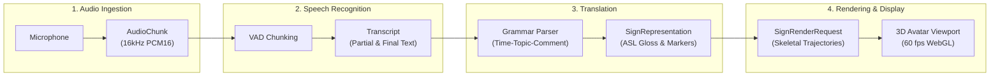

# Converse Data Flow Specification

Document Status: Active Baseline
Version: 1.0.0
Parent Architecture: docs/architecture.md

---

## 1. System Data Lifecycle Overview

Converse operates two bidirectional data pipelines where raw sensory media (video frames and audio waveforms) is progressively elevated into structured semantic representations, transformed across linguistic domains, and synthesized into target output modalities.

```text
Physical Modality         Geometric/Acoustic          Linguistic Semantic         Target Modality
┌─────────────────┐       ┌────────────────────┐      ┌────────────────────┐      ┌─────────────────┐
│ Raw Video       │ ----> │ SignObservation    │ ---> │ SignRepresentation │ ---> │ English Text    │
│ Camera Stream   │       │ Coordinates/Tensors│      │ Tokens & Grammar   │      │ & Audio Stream  │
└─────────────────┘       └────────────────────┘      └────────────────────┘      └─────────────────┘
         ▲                                                                                 │
         │                                                                                 ▼
┌─────────────────┐       ┌────────────────────┐      ┌────────────────────┐      ┌─────────────────┐
│ Visual Avatar   │ <---- │ SignRenderRequest  │ <--- │ SignRepresentation │ <--- │ English Speech  │
│ 3D Animation    │       │ Skeletal Frames    │      │ Tokens & Grammar   │      │ Microphone PCM  │
└─────────────────┘       └────────────────────┘      └────────────────────┘      └─────────────────┘
```

---

## 2. Pipeline A: Sign-to-Speech Data Flow

Pipeline A transforms live video of American Sign Language (ASL) into synthesized spoken English audio.

```mermaid
flowchart LR
    subgraph Capture["1. Capture"]
        Cam["Camera Sensor"] --> VF["VideoFrame\n(RGB/YUV Buffer)"]
    end

    subgraph Observation["2. Observation"]
        VF --> FL["FrameLandmarks\n(Normalized 3D Points)"]
    end

    subgraph Understanding["3. Understanding"]
        FL --> SW["Sliding Window Buffer\n(W=30, S=10)"]
        SW --> SD["SignDetection\n(Gloss Candidate & Conf)"]
    end

    subgraph Representation["4. Representation"]
        SD --> SR["SignRepresentation\n(ASL Tokens & Markers)"]
    end

    subgraph Translation["5. Translation"]
        SR --> TR["TranslationResult\n(English Text & Status)"]
    end

    subgraph Synthesis["6. Synthesis & Output"]
        TR --> AC["AudioChunk\n(Streaming PCM/Opus)"]
        AC --> Spk["Speaker / Virtual Mic"]
    end
```



### 2.1 Stage A1: Camera Sensor to VideoFrame
- **Origin**: Client device webcam or mobile camera.
- **Physical Characteristics**: 720p (1280x720) or 1080p (1920x1080), captured at 30 to 60 fps.
- **Data Payload**: Uncompressed raw pixel buffer or compressed video frame.
- **Transport Decision**: Video frames are processed locally on the client or sent over WebRTC video tracks. Raw video frames are **never** serialized as JSON across WebSockets due to prohibitive network bandwidth (a single 720p 30fps stream in raw RGBA requires ~110 MB/s).

```typescript
export interface VideoFrameMetadata {
  sessionId: string;
  frameId: number;
  timestampMs: number;
  width: number;
  height: number;
  pixelFormat: "rgba32" | "rgb24" | "yuv420";
}
```

### 2.2 Stage A2: VideoFrame to SignObservation (FrameLandmarks)
- **Processor**: Client-side landmark estimator (MediaPipe / WebGPU) or server-side vision ingestion service (`ml/asl-vision`).
- **Function**: Extracts 3D skeletal keypoints from the visual frame.
- **Coordinate Conventions**:
  - Normalized coordinates: $x \in [0.0, 1.0]$ across frame width; $y \in [0.0, 1.0]$ across frame height.
  - Depth coordinate: $z$ represents relative depth scaled with hand/torso proportions.
  - Torso Normalization: Origin is centered between left and right shoulder landmarks. Scale is normalized by the Euclidean distance between shoulders to ensure scale invariance regardless of signer distance from the camera.
- **Landmark Topologies**:
  - Left Hand: 21 3D points (wrist, thumb CMC/MCP/IP/TIP, finger joints).
  - Right Hand: 21 3D points.
  - Upper-Body Pose: 33 3D points (shoulders, elbows, wrists, hips).
  - Face Mesh: Key contour points for eyebrow deflection, eye aperture, mouth morphemes, and head orientation.

```typescript
export interface Point3D {
  x: number;
  y: number;
  z: number;
  visibility?: number;
}

export interface HandLandmarks {
  landmarks: Point3D[];
  handedness: "left" | "right";
  confidence: number;
}

export interface FrameLandmarks {
  sessionId: string;
  frameId: number;
  timestampMs: number;
  leftHand?: HandLandmarks;
  rightHand?: HandLandmarks;
  pose?: { landmarks: Point3D[] };
  faceMesh?: { landmarks: Point3D[] };
  trackingConfidence: number;
}
```

### 2.3 Stage A3: SignObservation to SignUnderstanding (SignDetection)
- **Processor**: Temporal Sequence Recognizer (`ml/asl-vision`).
- **Function**: Aggregates temporal sequences of `FrameLandmarks` in a sliding ring buffer ($W=30$ frames with stride $S=10$ frames). Detects sign onset, stroke apex, and sign retraction boundaries (sign spotting).
- **Output**: Discrete candidate sign detections with associated confidence and temporal bounds.

```typescript
export interface SignDetection {
  gloss: string;
  confidence: number;
  startTimeMs: number;
  endTimeMs: number;
  isBoundary: boolean;
  alternatives?: Array<{ gloss: string; confidence: number }>;
}
```

### 2.4 Stage A4: SignUnderstanding to SignRepresentation
- **Processor**: Feature Aggregator / Representation Mapper (`ml/asl-vision`).
- **Function**: Binds manual sign detections with non-manual facial markers and directional spatial markers into the canonical linguistic representation.
- **Linguistic Context**: A sign detection of `WHERE` is incomplete without eyebrow positioning. Lowered eyebrows convert the manual sign into a grammatical Wh-question; raised eyebrows designate a conditional or topic marker.

```typescript
export interface NonManualMarkers {
  eyebrows: "neutral" | "raised" | "furrowed";
  headTilt: "none" | "left" | "right" | "forward" | "back";
  mouthMorpheme?: string;
}

export interface SignToken {
  id: string;
  gloss: string;
  startTimeMs: number;
  endTimeMs: number;
  confidence: number;
  nonManualMarkers?: NonManualMarkers;
  spatialIndex?: string;
}

export interface ASLRepresentation {
  language: "ASL";
  tokens: SignToken[];
  source: {
    model: string;
    version: string;
  };
}
```

### 2.5 Stage A5: SignRepresentation to TranslationResult
- **Processor**: Language Translation Engine (`ml/translation`).
- **Function**: Converts structured ASL gloss token streams into natural, grammatically correct English sentences.
- **Linguistic Transformation**:
  - ASL Syntax: Time-Topic-Comment (e.g. `[YESTERDAY, STORE, I, GO]`).
  - English Syntax: Subject-Verb-Object with inflected tense and articles (e.g. "I went to the store yesterday.").
- **Status Semantics**:
  - `partial`: Emitted during ongoing signing to update real-time visual captions for the user. Does not trigger speech synthesis.
  - `final`: Emitted when phrase boundary or pause is confirmed. Commits downstream speech synthesis.

```typescript
export interface TranslationResult {
  sessionId: string;
  sourceLanguage: "ASL";
  targetLanguage: "en";
  englishText: string;
  glosses: string[];
  confidence: number;
  status: "partial" | "final";
  latencyMs: number;
  model: {
    name: string;
    version: string;
  };
}
```

### 2.6 Stage A6: TranslationResult to AudioChunk
- **Processor**: Neural Text-to-Speech Engine (`ml/tts`).
- **Function**: Ingests finalized English sentences or coherent clauses and synthesizes continuous audio streams without waiting for paragraph-level text completion.
- **Audio Output Format**: 16-bit linear PCM at 16,000 Hz or 24,000 Hz, or Opus packets.
- **Chunk Sizing**: Chunks are emitted at 100ms to 200ms audio increments to ensure rapid time-to-first-audio playout.

```typescript
export interface AudioChunk {
  sessionId: string;
  sequenceNumber: number;
  timestampMs: number;
  format: "pcm_s16le" | "opus";
  sampleRate: number;
  channels: 1;
  dataBase64: string;
  isLastChunk: boolean;
  durationMs: number;
}
```

---

## 3. Pipeline B: Speech-to-Sign Data Flow

Pipeline B transforms spoken English audio into rendered visual ASL avatar gestures.



### 3.1 Stage B1: Audio Ingestion to AudioChunk
- **Origin**: Device microphone or incoming WebRTC meeting audio track.
- **Acoustic Characteristics**: 16 kHz or 48 kHz, single channel (mono), 16-bit signed PCM.
- **Segmentation**: Pre-processed by local Voice Activity Detection (VAD) into streaming frames of 60ms to 100ms.

### 3.2 Stage B2: AudioChunk to Transcript
- **Processor**: Streaming Automatic Speech Recognition (`ml/asr`).
- **Function**: Transcribes acoustic audio frames into English words with millisecond timing offsets.
- **Partial vs. Final Stream**: Emits `partial` results as hypotheses evolve; commits `final` results upon detection of acoustic pause or syntactic closure.

```typescript
export interface Transcript {
  sessionId: string;
  text: string;
  startTimeMs: number;
  endTimeMs: number;
  confidence: number;
  status: "partial" | "final";
}
```

### 3.3 Stage B3: Transcript to SignRepresentation
- **Processor**: English-to-ASL Translation Engine (`ml/translation`).
- **Function**: Converts English grammatical sentences into ordered ASL sign tokens and accompanying facial expression directives.
- **Structural Rules**:
  - Time head extraction: "I will call you tomorrow" -> `[TOMORROW, I, CALL, YOU]`.
  - Question syntax: "Where are you going?" -> `[YOU, GO, WHERE]` with `eyebrows: "furrowed"`.
  - Out-of-Vocabulary (OOV) Fallback: Proper nouns or unrecognized terms are decomposed into fingerspelled character tokens (`[F-I-L-E-M-O-N]`).

```typescript
export interface SignTokenWithRender {
  gloss: string;
  durationMs: number;
  emphasis: boolean;
  nonManualMarkers?: NonManualMarkers;
  fingerspelling?: string[];
}

export interface TextToSignResponse {
  sessionId: string;
  tokens: SignTokenWithRender[];
  totalDurationMs: number;
  latencyMs: number;
}
```

### 3.4 Stage B4: SignRepresentation to SignRenderRequest
- **Processor**: Avatar Skeletal Synthesis Engine (Client WebGL / Canvas).
- **Function**: Converts sign tokens into smooth, continuous bone-joint rotational quaternions and facial morph targets at 60 fps.
- **Co-articulation**: Applies Catmull-Rom or cubic spline interpolation between sequential sign poses to eliminate robotic transitions and model realistic human physical inertia.

---

## 4. Cross-Cutting Data Contract Invariants

### 4.1 Timestamp Semantics
To calculate real-time latency across distributed services, all contracts distinguish between capture time and processing time:
1. `captureTimestampMs`: Milliseconds since epoch when physical camera frame or audio sample entered the device driver.
2. `processingTimestampMs`: Milliseconds since epoch when a pipeline node completed transformation.
- The difference $\Delta t = t_{\text{processing}} - t_{\text{capture}}$ yields the cumulative processing delay up to that stage.

### 4.2 Sequence Numbering
Every streaming channel (`frame_landmarks`, `audio_chunk`, `tts_audio`) incorporates a monotonically increasing unsigned 32-bit `sequenceNumber`:
- Detects packet loss across network transports.
- Prevents out-of-order execution in concurrent workers.
- Triggers frame-skipping or buffer flush when sequence gaps exceed threshold.

### 4.3 Confidence Scoring Matrix
Every machine learning output includes a normalized confidence score $C \in [0.0, 1.0]$:

| Confidence Tier | Threshold Range | System Action | UI / Audio Behavior |
|---|---|---|---|
| High Confidence | $C \ge 0.82$ | Automated Execution | Speech is synthesized; avatar executes gestures immediately. |
| Medium Confidence | $0.55 \le C < 0.82$ | Conditional Execution | Output executes, but subtle confirmation indicator appears on screen. |
| Low Confidence | $C < 0.55$ | Execution Suppressed | Speech synthesis suppressed; non-intrusive disambiguation card presented. |

### 4.4 Cross-Language Schema Synchronization
Data contracts are authored in TypeScript within `packages/contracts` and enforced using Zod schemas. Python services (`ml/*`) mirror these schemas using equivalent Pydantic v2 models:

```typescript
// TypeScript Contract (packages/contracts/src/translation.ts)
import { z } from "zod";

export const SignToTextResponseSchema = z.object({
  englishText: z.string(),
  confidence: z.number().min(0).max(1),
  glosses: z.array(z.string()),
  status: z.enum(["partial", "final"]),
  latencyMs: z.number().nonnegative(),
});

export type SignToTextResponse = z.infer<typeof SignToTextResponseSchema>;
```

```python
# Python Mirror (ml/translation/schemas.py)
from pydantic import BaseModel, Field
from typing import List, Literal

class SignToTextResponse(BaseModel):
    englishText: str
    confidence: float = Field(ge=0.0, le=1.0)
    glosses: List[str]
    status: Literal["partial", "final"]
    latencyMs: float = Field(ge=0.0)
```
