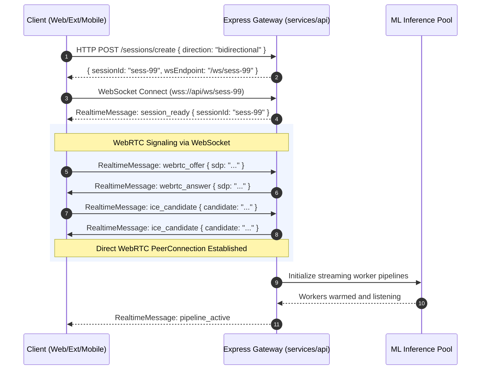
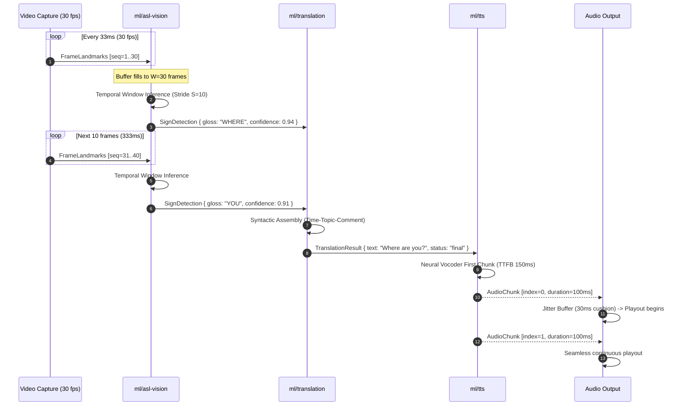

# Converse Real-Time Architecture Specification

Document Status: Active Baseline
Version: 1.0.0
Parent Architecture: docs/architecture.md

---

## 1. Principles of Real-Time Conversational Communication

Human conversation operates under strict latency tolerances. Psycholinguistic research demonstrates that natural conversational turn-taking between speakers occurs within a gap of approximately **200ms to 800ms**. When end-to-end communication latency exceeds 1,000ms:
- Conversational flow breaks down.
- Speakers experience cognitive dissonance and repeatedly talk over one another (collision).
- Signers must artificially hold gestures or restart phrases, destroying spatial grammar.

To guarantee conversational fluency, Converse abandons traditional request-response architectures in favor of **bidirectional streaming, sliding window inference, and pipeline concurrency**.

---

## 2. Dual-Channel Protocol Topology

Converse separates media streaming from control telemetry through a dual-channel transport model:

```
┌────────────────────────────────────────────────────────┐
│                      Client Device                     │
│               (Web / Extension / Mobile)               │
└──────────────┬──────────────────────────┬──────────────┘
               │                          │
      WebRTC Media Channel       WebSocket Event Channel
   (Audio/Video, DTLS/SRTP)     (Control/Telemetry, JSON/WSS)
               │                          │
               ▼                          ▼
┌────────────────────────────────────────────────────────┐
│             API Gateway & Signaling Server             │
│                    (services/api)                      │
└──────────────┬──────────────────────────┬──────────────┘
               │                          │
   High-Throughput IPC        High-Throughput IPC
               │                          │
               ▼                          ▼
┌──────────────────────────┐   ┌──────────────────────────┐
│   Streaming ML Workers   │   │   Streaming ML Workers   │
│  (ml/asl-vision, ml/asr) │   │ (ml/translation, ml/tts) │
└──────────────────────────┘   └──────────────────────────┘
```

### 2.1 Channel 1: Media Channel (WebRTC)
- **Role**: Transports high-bandwidth, latency-sensitive continuous media tracks (camera video and microphone audio).
- **Protocol**: Real-time Transport Protocol (RTP) secured via Datagram Transport Layer Security (DTLS) and Secure RTP (SRTP).
- **Audio Codec**: Opus (16-48 kHz, full-band mono, 20ms packet frame size, with in-band Forward Error Correction enabled).
- **Video Codec**: VP8 or H.264 constrained baseline profile, dynamically adjusting bitrate via Google Congestion Control (GCC) and RTCP receiver reports.

### 2.2 Channel 2: Event and Telemetry Channel (WebSocket)
- **Role**: Transports structured state events, normalized landmark vectors, partial transcripts, confidence metrics, and session signaling.
- **Protocol**: Secure WebSockets (`wss://`) over TLS 1.3.
- **Framing Envelope**: All messages follow the standard `RealtimeMessage` envelope:

```typescript
export interface RealtimeMessage<T = unknown> {
  id: string; // UUID v4
  sessionId: string;
  timestampMs: number; // Client capture or emit epoch time
  sequenceNumber: number; // Monotonically increasing counter
  type: string;
  payload: T;
}
```

### 2.3 Channel 3: WebRTC DataChannel Fallback
When network firewalls impede persistent WebSockets or when ultra-low latency is required for raw landmark coordinate streaming, Converse opens a WebRTC DataChannel labeled `converse-control`:
- Configured as **unordered with zero retransmissions** (`maxRetransmits: 0`) for continuous landmark frames, prioritizing arrival immediacy over guaranteed delivery.
- Configured as **reliable and ordered** for translation commitments and speech synthesis chunks.

---

## 3. Buffer Management and Sliding Window Inference

Real-time processing of continuous sign language cannot operate on complete video files. Converse utilizes temporal circular ring buffers and sliding window analysis.

### 3.1 Frame Rate and Downsampling Strategy
1. **Camera Capture**: 30 to 60 fps at 720p resolution.
2. **Landmark Extraction**: Executed on every incoming frame to maintain accurate velocity and trajectory calculations.
3. **Temporal Model Ingestion**: The temporal sequence recognizer does not evaluate on every individual frame. Observations are buffered into sliding windows:
   - **Window Size ($W$)**: 30 frames ($\approx 1,000\text{ ms}$ of continuous signing).
   - **Stride Step ($S$)**: 10 frames ($\approx 333\text{ ms}$ advance between inference invocations).
   - **Temporal Overlap**: 66.7% overlap between adjacent evaluation windows.

```
Frames (30 fps)
0         10        20        30        40        50        60
├─────────┼─────────┼─────────┼─────────┼─────────┼─────────┤
[====== Window 0 (0-30) ======]
          [====== Window 1 (10-40) ======]
                    [====== Window 2 (20-50) ======]
                              [====== Window 3 (30-60) ======]
```

### 3.2 Circular Ring Buffer Mechanics
The vision subsystem (`ml/asl-vision`) allocates a fixed-size pre-allocated circular ring buffer in memory holding 60 observation frames:
- **Zero Allocation**: Eliminates garbage collection pressure and memory fragmentation in Python and Node.js runtimes.
- **Overflow Policy**: When the buffer reaches capacity, incoming frames overwrite the oldest observations.
- **Boundary Detection**: Within each window, a sign-spotting classifier determines if a complete sign stroke apex has occurred. Once spotted with confidence $C \ge 0.82$, a `sign_detected` event is emitted.

### 3.3 Audio Jitter Buffer Management
For streaming TTS audio chunks returning to the client:
- Network jitter can cause gaps between successive audio chunks, producing choppy speech artifacts.
- The client-side audio player maintains a dynamic jitter buffer of **20ms to 60ms**.
- As soon as the first 40ms of audio is buffered, playback begins while subsequent chunks stream in parallel over the WebSocket.

### 3.4 Backpressure and Frame-Dropping Policies
When computational load on the host machine causes inference latency to exceed the stride duration ($L_{\text{inference}} > S$):
1. **Stride Escalation**: The stride step dynamically increases from $S=10$ to $S=15$ frames.
2. **Face Mesh Shedding**: Facial mesh extraction is throttled or reduced to primary eyebrow landmarks, preserving full 21-point hand tracking.
3. **Graceful Dropping**: If the circular buffer experiences overrun, intermediate non-boundary frames are dropped while maintaining sequence counter integrity.

---

## 4. Latency Budget Analysis and Pipeline Concurrency

### 4.1 Sequential vs. Pipelined Concurrent Latency
A naive sequential pipeline waits for each stage to completely finish before triggering the next stage. In contrast, Converse pipelines each stage concurrently:

```text
Sequential Latency (Store-and-Forward):
T_total = T_capture + T_vision + T_translation + T_tts_full + T_playback
T_total = 33ms + 250ms + 350ms + 500ms + 100ms = 1,233ms  (Unusable)

Pipelined Concurrent Latency (Converse Streaming):
T_first_audio = T_capture + T_landmarks + T_window_stride + T_trans_partial + T_tts_first_chunk + T_buffer
T_first_audio = 16ms + 25ms + 333ms + 80ms + 150ms + 30ms = 634ms  (Conversational)
```

```text
Time (ms)  0     100    200    300    400    500    600    700    800
Vision     [==Landmarks==][==Window 1==][==Window 2==]
Trans                     [==Token 1==] [==Sentence Commit==]
TTS                                     [==First Audio Chunk==]
Audio Out                                      [==Play Chk 1==][==Play Chk 2==]
```

### 4.2 Mathematical Latency Formulation
End-to-end latency for any conversational turn is calculated as:

$$L_{\text{total}} = L_{\text{capture}} + L_{\text{transport}} + L_{\text{queue}} + L_{\text{inference}} + L_{\text{translation}} + L_{\text{tts\_ttfb}} + L_{\text{jitter\_buffer}}$$

Where:
- $L_{\text{capture}}$: Hardware sensor digitization delay ($16\text{ms} - 33\text{ms}$).
- $L_{\text{transport}}$: Network propagation and serialization delay ($20\text{ms} - 50\text{ms}$).
- $L_{\text{queue}}$: Message broker or worker queue dwell time ($< 15\text{ms}$).
- $L_{\text{inference}}$: Neural spatiotemporal landmark sequence classification ($100\text{ms} - 180\text{ms}$).
- $L_{\text{translation}}$: ASL-to-English grammar translation ($140\text{ms} - 200\text{ms}$).
- $L_{\text{tts\_ttfb}}$: Text-to-Speech time-to-first-byte audio chunk ($150\text{ms} - 220\text{ms}$).
- $L_{\text{jitter\_buffer}}$: Client audio playout cushion ($20\text{ms} - 40\text{ms}$).

Total nominal time-to-first-audio: **$\approx 631\text{ ms}$**, safely within the 800ms conversational threshold.

---

## 5. Teleconferencing and Browser Extension Injection

The Chrome Extension (`apps/extension`) integrates Converse into Google Meet and Zoom without requiring host application reconfiguration or external virtual audio cables.

```
┌─────────────────────────────────────────────────────────────┐
│                 Browser Meeting Tab (DOM)                   │
│                                                             │
│   ┌─────────────────────┐       ┌───────────────────────┐   │
│   │ Google Meet Audio   │       │  Webcam Video Feed    │   │
│   │ Remote Participant  │       │  Local Deaf Signer    │   │
│   └──────────┬──────────┘       └───────────┬───────────┘   │
│              │                              │               │
│              ▼                              ▼               │
│   ┌─────────────────────┐       ┌───────────────────────┐   │
│   │ Offscreen Document  │       │ Content Script Hook   │   │
│   │ Web Audio Capture   │       │ Landmark Tracking     │   │
│   └──────────┬──────────┘       └───────────┬───────────┘   │
└──────────────┼──────────────────────────────┼───────────────┘
               │                              │
               ▼                              ▼
┌─────────────────────────────────────────────────────────────┐
│              Background Service Worker (MV3)                │
│             WebSocket Streaming to Converse Core            │
└──────────────────────────────┬──────────────────────────────┘
                               │
                               ▼
┌─────────────────────────────────────────────────────────────┐
│                 Converse API Gateway & ML                   │
│          Translation, Speech Recognition, & TTS             │
└──────────────────────────────┬──────────────────────────────┘
                               │
               ┌───────────────┴───────────────┐
               ▼                               ▼
┌─────────────────────────────┐ ┌─────────────────────────────┐
│  Synthesized Voice Audio    │ │  Translated Sign Tokens     │
│  Injected to Meeting Mic    │ │  Rendered in DOM Overlay    │
└─────────────────────────────┘ └─────────────────────────────┘
```

### 5.1 Architecture Under Chrome Extension Manifest V3
1. **Background Service Worker**:
   - Manages connection lifecycle and persistent WebSocket communication with `services/api`.
   - Coordinates state between meeting DOM and Converse ML core.
2. **Offscreen Document**:
   - Manifest V3 service workers cannot access the Web Audio API or DOM media streams.
   - Converse creates an offscreen document (`chrome.offscreen.createDocument`) to capture meeting audio tracks using `tabCapture` / `getDisplayMedia`.
3. **Content Script & Shadow DOM Overlay**:
   - Injects a floating, draggable, resizable widget into the meeting webpage.
   - Hosts a WebGL canvas rendering the 3D ASL avatar interpreting remote speakers.
   - Encapsulated in a Shadow DOM to isolate styles and prevent collision with meeting platform CSS.

### 5.2 Loopback Prevention and Acoustic Echo Cancellation (AEC)
A critical defect in naive voice injection systems is the **echo loop**:
- Converse translates signing into synthesized English speech.
- The synthesized audio is injected into the meeting microphone.
- The meeting software plays the audio back to participants.
- The Converse extension captures the meeting audio and attempts to translate its own synthesized speech back into sign language.

**Converse Echo Prevention Solution**:
1. **Track Segregation**: Injected audio tracks are tagged with a unique internal identifier.
2. **Software Muting**: When Converse initiates TTS playout, the offscreen document audio worklet applies an acoustic mask or active cancellation filter to the local ASR input stream for the duration of the audio playback.
3. **Feedback Suppression**: Transcribed phrases matching recently synthesized output within a 3-second window are automatically discarded by the ASR deduplication filter.

---

## 6. Real-Time Protocol Sequence Diagrams

### 6.1 Call Setup and WebRTC/WebSocket Negotiation



### 6.2 Sign-to-Speech Streaming Lifecycle


