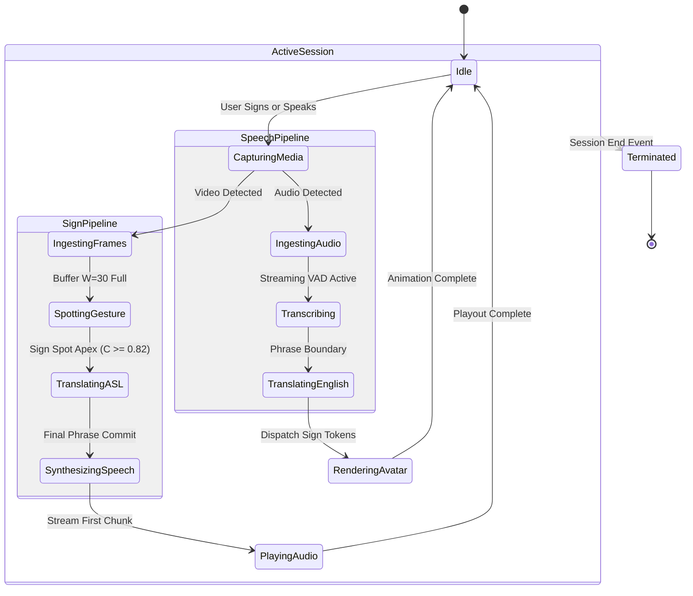

# Converse Runtime Architecture Specification

Document Status: Active Baseline
Version: 1.0.0
Parent Architecture: docs/architecture.md

---

## 1. Runtime Process Model and Execution Environments

Converse spans multiple execution environments across client devices, Node.js orchestration services, and Python-based machine learning runtimes.

```
┌────────────────────────────────────────────────────────────────────────┐
│                        Client Runtimes                                 │
│                                                                        │
│  apps/web                    apps/extension             apps/mobile    │
│  Next.js 14+ / React         Service Worker + Offscreen React Native   │
│  Browser V8 / WebGL          Chrome MV3 / Web Audio     Hermes / Canvas│
└───────────────────────────────────┬────────────────────────────────────┘
                                    │
                       WebSocket & WebRTC (TLS/DTLS)
                                    │
                                    ▼
┌────────────────────────────────────────────────────────────────────────┐
│                        Orchestration Runtime                           │
│                                                                        │
│  services/api                                                          │
│  Node.js 20+ / TypeScript / Express.js                                 │
│  Session Management, WebRTC Signaling, Event Hub                      │
└───────────────────────────────────┬────────────────────────────────────┘
                                    │
                       Internal High-Throughput IPC
                                    │
                                    ▼
┌────────────────────────────────────────────────────────────────────────┐
│                        ML Worker Runtimes                              │
│                                                                        │
│  ml/asl-vision          ml/translation        ml/asr         ml/tts    │
│  Python 3.11+           Python 3.11+          Python 3.11+   Python    │
│  PyTorch / OpenCV       PyTorch / Transformers TorchAudio    ONNX/CUDA │
│  (Managed via uv)       (Managed via uv)      (uv-managed)   (uv)      │
└────────────────────────────────────────────────────────────────────────┘
```

### 1.1 Node.js Orchestration Runtime (`services/api`)
- **Engine**: Node.js LTS (v20+) running TypeScript under Express.js.
- **Role**: Application API gateway, session coordinator, WebRTC signaling relay, and WebSocket event distribution router.
- **Concurrency Model**: Event-driven, non-blocking asynchronous I/O. Uses native Node.js cluster workers or lightweight thread workers for socket connection pooling.
- **Boundary Restriction**: The Express service **never** executes PyTorch or heavy tensor computations directly within the Node.js event loop, preventing event loop blocking.

### 1.2 Python Machine Learning Runtimes (`ml/*`)
- **Engine**: Python 3.11+ running in hermetic virtual environments created and managed exclusively by `uv`.
- **Packaging and Dependencies**: Configured via isolated `pyproject.toml` per subsystem:
  - `ml/asl-vision`: PyTorch, OpenCV, NumPy, MediaPipe/Custom Spatiotemporal model.
  - `ml/translation`: PyTorch, Hugging Face Transformers, Tokenizers.
  - `ml/asr`: PyTorch, TorchAudio, Streaming VAD (Silero).
  - `ml/tts`: ONNX Runtime / PyTorch neural vocoder.
- **Execution Model**: Long-running background daemon processes exposing high-throughput streaming endpoints (HTTP/2 or gRPC).

### 1.3 Client Application Runtimes
1. **Web Client (`apps/web`)**:
   - V8 JavaScript engine in modern browsers.
   - Web Workers for non-blocking landmark estimation.
   - WebGL / WebGPU canvas for rendering real-time skeletal 3D animations.
2. **Chrome Extension (`apps/extension`)**:
   - Background Service Worker: Short-lived execution lifecycle managing WebSocket streams and storage.
   - Offscreen Document: Persistent runtime with access to DOM audio APIs, managing `AudioContext` and Web Audio worklets.
   - Content Script: Injected into Google Meet / Zoom DOM; renders visual overlays inside an isolated Shadow DOM.
3. **Mobile Client (`apps/mobile`)**:
   - React Native running on the Hermes JavaScript engine.
   - Native camera modules (Expo Camera) streaming frames via native bridge buffers.
   - Native audio modules (Expo AV) supporting simultaneous full-duplex capture and playback.

---

## 2. Logical vs. Deployment Boundaries (Topology Evolution)

Converse strictly separates *what components do* (logical boundaries) from *where components run* (deployment boundaries). This allows the system to evolve across three operational phases without rewriting contracts.

```
Phase 1: Local Development        Phase 2: Hybrid Cloud             Phase 3: Edge Distributed
┌───────────────────────────┐    ┌───────────────────────────┐     ┌───────────────────────────┐
│ Host Workstation          │    │ Client Applications       │     │ Client Device (Edge)      │
│ ┌───────────────────────┐ │    │ (Web / Extension / Mobile)│     │ ┌───────────────────────┐ │
│ │ Express API           │ │    └─────────────┬─────────────┘     │ │ Local MediaPipe CV    │ │
│ └───────────┬───────────┘ │                  │                   │ └───────────┬───────────┘ │
│             │ localhost   │                  ▼                   └─────────────┼─────────────┘
│ ┌───────────▼───────────┐ │    ┌───────────────────────────┐                   │ Normalized Landmarks
│ │ Python ML Subsystems  │ │    │ Cloud Express API Cluster │                   ▼
│ └───────────────────────┘ │    └─────────────┬─────────────┘     ┌───────────────────────────┐
└───────────────────────────┘                  │                   │ Regional Inference Edge   │
                                 ┌─────────────┴─────────────┐     │ ┌───────────────────────┐ │
                                 ▼                           ▼     │ │ ASL Translation & ASR │ │
                          ┌─────────────┐             ┌──────────┐ │ └───────────┬───────────┘ │
                          │ GPU Workers │             │ CPU Pool │ └─────────────┼─────────────┘
                          │ Vision/TTS  │             │ Trans/ASR│                   ▼
                          └─────────────┘             └──────────┘         [Cloud Neural Vocoder]
```

### 2.1 Phase 1: Local Prototype Topology
- Single workstation deployment.
- Express API runs on `localhost:3001`.
- Python ML components run locally as background processes on dedicated ports (`localhost:5001` to `5004`) communicating via local loopback sockets.
- Simplifies rapid development, local debugging, and integration testing.

### 2.2 Phase 2: Hybrid Cloud and Containerized Microservices
- Express API packaged as lightweight Alpine-based container on Amazon ECS or Kubernetes.
- `ml/asl-vision` and `ml/tts` deployed on GPU-accelerated container instances (e.g. AWS `g4dn.xlarge` with NVIDIA T4 GPUs).
- `ml/translation` and `ml/asr` deployed on high-concurrency CPU container pools (e.g. AWS `c6i.xlarge`).
- Inter-service communication via internal gRPC channels with persistent HTTP/2 connection pooling.

### 2.3 Phase 3: Distributed Edge Inference Topology
- **Client Edge**: High-efficiency landmark tracking executes directly on client hardware (WebAssembly/WebGPU on browser, Apple CoreML / Android NNAPI on mobile).
- **Bandwidth Reduction**: Transmitting numerical landmark vectors requires **$< 150\text{ KB/s}$**, representing a 98% bandwidth reduction compared to transmitting 720p raw video.
- **Regional Edge**: Lightweight translation models run in regional edge nodes close to users.
- **Central Cloud**: Heavy multi-speaker neural TTS vocoders run in GPU data centers.

---

## 3. Session Coordination and State Machine

A communication `Session` is the fundamental runtime aggregate in Converse. All media streams, translations, telemetry events, and metrics belong to a session.

### 3.1 Session Lifecycle States
A session progresses through five formal states:

```
[INIT] ──> NEGOTIATING ──> ACTIVE ──> PAUSED ──> TERMINATED
                │            │           ▲
                │            ▼           │
                └────────> ERROR ────────┘
```

1. **`NEGOTIATING`**: Client connects, exchanges authentication tokens, selects translation direction, and performs WebRTC SDP signaling.
2. **`ACTIVE`**: Bi-directional streaming is operational; frames and audio chunks are processed continuously.
3. **`PAUSED`**: User temporarily mutes audio or disables video. Workers enter low-power idle state; circular buffers are flushed.
4. **`ERROR`**: Subsystem failure occurs (e.g. camera disconnect, network drop). Triggers non-blocking UI alert and recovery attempt.
5. **`TERMINATED`**: Session closes. All WebRTC peer connections terminate; memory buffers and GPU context tensors are explicitly deallocated.

### 3.2 Session Sub-State Machine (Streaming)



---

## 4. Cross-Boundary Communication Protocols

Subsystems communicate across runtime boundaries using standardized communication primitives:

| Boundary | Transport Protocol | Serialization | Guarantees |
|---|---|---|---|
| Client <-> Express API (Control) | WebSocket over TLS 1.3 | JSON Envelope (`RealtimeMessage`) | Ordered, reliable, bi-directional |
| Client <-> Express API (Media) | WebRTC (DTLS/SRTP) | Opus Audio / VP8 Video | Sub-100ms, non-blocking, adaptive |
| Client <-> Express API (DataChannel)| WebRTC SCTP DataChannel | Binary / JSON | Unordered, 0 retransmits for landmarks |
| Express API <-> Python ML Services | HTTP/2 Streaming / gRPC | Protocol Buffers or NDJSON | Low latency, multiplexed, typed |
| ML Service <-> ML Service | Internal Unix Domain / Localhost | Shared Memory / Tensors | Zero-copy when co-located |

---

## 5. Observability, Distributed Tracing, and Telemetry

Converse implements structured telemetry to ensure sub-second conversational latency can be diagnosed and optimized at every stage.

### 5.1 Distributed Trace Context
Every operation carries a tracing context across network and process boundaries:

```typescript
export interface TraceContext {
  traceId: string; // UUID v4 shared across the entire transaction
  spanId: string; // Identifier for the current subsystem operation
  parentSpanId?: string; // Identifier of the upstream calling operation
  sessionId: string; // Active Converse communication session
  timestampMs: number; // Node entry epoch time
}
```

### 5.2 Structured Log Schema
All services emit single-line JSON log entries containing uniform keys:

```json
{
  "timestamp": "2026-09-17T19:50:26.104Z",
  "level": "INFO",
  "component": "ml/asl-vision",
  "traceId": "c8f7d6a4-2e1b-4f3a-9c8d-7e6f5a4b3c2d",
  "sessionId": "sess-409",
  "event": "sign_detected",
  "payload": {
    "gloss": "HELLO",
    "confidence": 0.94,
    "latencyMs": 84,
    "model": "asl-spatiotemporal-v1.2"
  }
}
```

### 5.3 Latency Milestone Aggregation
The Express API gateway tracks end-to-end latency waterfalls for each completed utterance:
- $L_{\text{cv\_extract}}$: Time to extract landmarks from raw frame.
- $L_{\text{temporal\_infer}}$: Time to classify sliding window gesture.
- $L_{\text{syntax\_trans}}$: Time to generate English sentence.
- $L_{\text{tts\_ttfb}}$: Time to synthesize first audio chunk.
- $L_{\text{network\_rtt}}$: Measured WebRTC round-trip delay.

If the aggregate latency $L_{\text{total}} > 800\text{ ms}$, a telemetry alert (`LATENCY_BUDGET_EXCEEDED`) is triggered for performance profiling.

---

## 6. Security, Privacy, and Resource Hygiene

### 6.1 Ephemeral In-Memory Processing Invariant
Converse is designed for privacy-critical environments (medical, legal, personal):
- Raw video frames and raw audio buffers exist strictly in volatile memory (RAM).
- Media is processed as transient streaming chunks and garbage collected immediately after landmark extraction or transcription.
- **Zero Persistent Media Writes**: Neither client applications nor backend services ever write uncompressed video or audio recordings to persistent disk or cloud object storage during normal operation.

### 6.2 Process Lifecycle and Resource Hygiene
To prevent resource leaks and orphan processes:
1. **Subprocess Tracking**: When running local ML workers, `services/api` tracks PID handles and registers `SIGTERM` / `SIGINT` shutdown hooks to terminate child workers cleanly.
2. **Socket Sweeping**: A heartbeat ping-pong interval (30 seconds) monitors WebSocket client connections. Stale connections are pruned, and corresponding session allocations are released.
3. **GPU Context Deallocation**: Python ML workers execute periodic PyTorch CUDA cache sweeps (`torch.cuda.empty_cache()`) during session idle pauses to prevent GPU out-of-memory (OOM) errors.

### 6.3 Authentication and Encryption
- **Signaling**: Authenticated via short-lived JSON Web Tokens (JWT) issued during session initialization.
- **Transport Security**: TLS 1.3 enforced for all HTTP and WebSocket connections. DTLS 1.2 with SRTP AES-128-GCM enforced for all WebRTC media streams.
