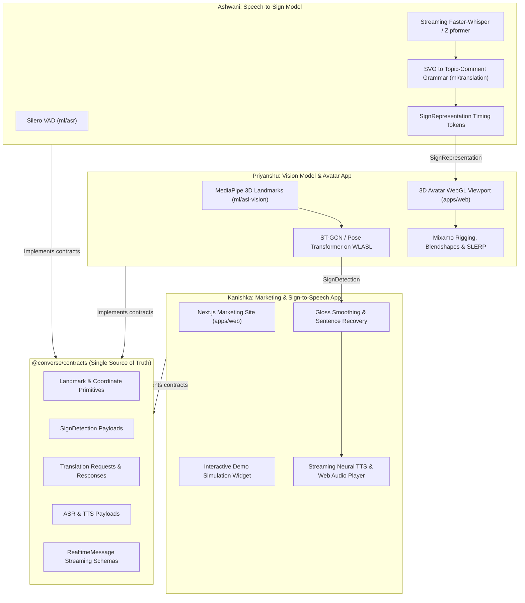

# Converse Project Milestones and Engineering Tracks

This directory contains the engineering roadmaps, milestone specifications, and architectural decision guides for the Converse real-time bidirectional ASL and English communication engine.

---

## Directory Structure

```
docs/milestones/
├── README.md                 # This index and engineering track overview
├── overview.md               # Master system-wide roadmap (Milestones 0 to 4)
├── ashwani/
│   └── milestones.md         # Speech-to-Sign Model Pipeline (VAD, Streaming ASR, Grammar Transformation, Timing Tokens)
├── kanishka/
│   └── milestones.md         # Marketing Site & Sign-to-Speech Application Pipeline (Sentence Reconstruction, Streaming TTS)
└── priyanshu/
    ├── milestones.md         # Sign-to-Speech Model Pipeline (3D Landmarks, ST-GCN) & Speech-to-Sign Avatar Engine (WebGL, Rigging)
    └── remaining-work.md     # Unassigned System Scope and Remaining Work Backlog
```

---

## Engineering Ownership and Scope Boundaries

To maximize parallel velocity while maintaining rigorous subsystem decoupling, the engineering tracks are divided across the model and application layers:

| Engineer | Track / Responsibility | Subsystem Domain | Primary Repositories / Paths |
| :--- | :--- | :--- | :--- |
| **Ashwani** | Speech-to-Sign Model Pipeline | Machine Learning / NLP | `ml/asr/`, `ml/translation/` |
| **Kanishka** | Marketing Site & Sign-to-Speech Application Pipeline | Frontend / Web Audio / NLP App | `apps/web/`, `packages/ui/`, `services/api/` |
| **Priyanshu** | Sign-to-Speech Model Pipeline & Speech-to-Sign Avatar Engine | Computer Vision & 3D WebGL / Graphics | `ml/asl-vision/`, `apps/web/`, `packages/ui/` |



---

## Shared Architectural Invariants

All engineers must adhere to the following monorepo invariants:

1. **Single Source of Truth**: All inter-service message schemas, coordinate frames, and payload interfaces are defined in `@converse/contracts`. Engineers must never define duplicate data interfaces across packages.
2. **Explicit Error Semantics**: Functions crossing package or network boundaries must return `Result<T, E>` or `Option<T>` constructs rather than throwing uncaught exceptions.
3. **Tooling Discipline**:
   - TypeScript workspaces are strictly managed via `pnpm` (`pnpm build`, `pnpm check-types`, `pnpm lint`).
   - Python ML workspaces are strictly managed via `uv` (`uv venv`, `uv pip`, `uv run pytest`, `uv run ruff`).
4. **Zero Emoji Standard**: Strictly zero emojis in source code, comments, documentation, UI strings, and commit messages.
5. **Open-Ended Decision Making**: The individual milestone documents provide concrete input/output contracts, recommended research papers, and evaluation criteria, while leaving the internal algorithm selections and architectural tradeoffs open for engineer exploration and benchmarking.

---

## System Roadmap Reference

For the comprehensive end-to-end roadmap detailing Monorepo Setup (Milestone 0), ASL Vision (Milestone 1), Translation Engine (Milestone 2), Real-time Streaming API (Milestone 3), and VoIP / Extension Integration (Milestone 4), consult [overview.md](file:///home/bhondu/coding/hackathon/bharat_builds/converse/docs/milestones/overview.md).
