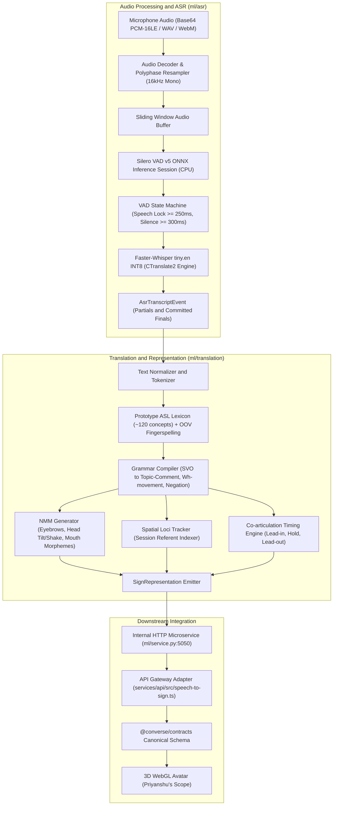
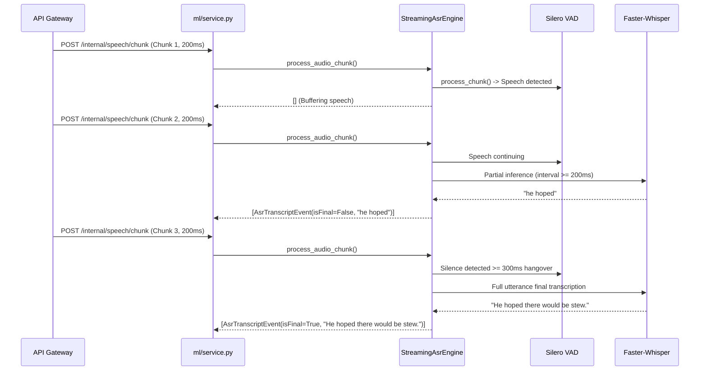

# Speech-to-Sign Pipeline: Comprehensive Milestone Implementation Report

- **Engineer**: Ashwani
- **Role**: Speech-to-Sign Model Pipeline (Audio Signal Processing, VAD, ASR, English-to-ASL Translation, Timing, Spatial Loci, SignRepresentation)
- **Branch**: `feature/speech-to-sign-pipeline`
- **Scope Directories**: `ml/asr/`, `ml/translation/`, `ml/service.py`, `ml/scripts/`, `packages/contracts/src/speech.ts`, `packages/contracts/src/translation.ts`, `packages/contracts/src/realtime.ts`, `services/api/src/speech-to-sign.ts`

---

## 1. Executive Summary and Problem Formulation

The Speech-to-Sign subsystem transforms continuous spoken English audio captured from a standard microphone into a time-aligned sequence of American Sign Language (ASL) sign tokens and non-manual markers, packaged into a canonical `SignRepresentation` for downstream 3D avatar animation.

Spoken English and American Sign Language are structurally distinct languages. ASL is not encoded English; it possesses an independent grammatical topology characterized by:
1. Topic-Comment and Time-Subject-Object-Verb (TSOV) word orders rather than standard English Subject-Verb-Object (SVO).
2. Grammatical non-manual markers (NMM), including eyebrow furrows for Wh-questions, eyebrow raises for Yes/No questions, and head shakes for clausal negation.
3. Spatial indexing where discourse referents are mapped to physical coordinates in 3D signing space.
4. Fingerspelling decomposition for proper nouns and vocabulary items outside the prototype sign dictionary.

The engineering challenge was to replace early prototype mock implementations and heuristic acoustic placeholders with genuine, model-backed, linguistically honest, and latency-budgeted machine learning components that execute locally on CPU hardware without external cloud API dependencies.

---

## 2. Architecture and Pipeline Overview

The pipeline operates across an audio-to-text stage (`ml/asr`), a text-to-ASL translation and compilation stage (`ml/translation`), an internal RPC microservice (`ml/service.py`), and a TypeScript API gateway adapter (`services/api/src/speech-to-sign.ts`).



### Subsystem Boundaries and Responsibilities

1. **Ashwani Scope (Self)**:
   - Audio buffer management, decoding, polyphase bandlimited resampling to 16kHz (`ml/asr/src/asr/buffer.py`).
   - Neural Voice Activity Detection via Silero VAD v5 ONNX and temporal state machine (`ml/asr/src/asr/vad.py`).
   - Pretrained ASR model inference via Faster-Whisper tiny.en INT8 (`ml/asr/src/asr/engine.py`).
   - English-to-ASL syntactic reordering and rule compiler (`ml/translation/src/translation/grammar_rules.py`).
   - Non-manual marker deterministic generator (`ml/translation/src/translation/nmm_detector.py`).
   - Prototype ASL lexicon lookup and fingerspelling decomposition (`ml/translation/src/translation/fingerspelling.py`).
   - Monotonic sign timing and co-articulation engine (`ml/translation/src/translation/timing_model.py`).
   - Session-aware 3D discourse spatial referent tracking (`ml/translation/src/translation/spatial_loci.py`).
   - Canonical `SignRepresentation` serialization and schema validation (`ml/translation/src/translation/representation_emitter.py`).
   - Internal RPC microservice (`ml/service.py`) and TypeScript gateway adapter (`services/api/src/speech-to-sign.ts`).
   - Test suites, verification scripts, and empirical benchmark suites.

2. **Priyanshu Scope (Untouched)**:
   - 3D WebGL Avatar rendering pipeline (`apps/web/components/avatar/`).
   - Skeletal rigging and blendshape interpolation runtime.
   - Camera input ingestion, MediaPipe Holistic landmark extraction, and ST-GCN sign detection (`ml/asl-vision/`).

3. **Kanishka Scope (Untouched)**:
   - Next.js application frontend and conversation user interface (`apps/web/app/`, `apps/web/lib/`).
   - Accessibility features and UI theme configurations.
   - Neural TTS audio player and sign-to-speech smoothing.

---

## 3. Hardware Platform, Runtime, and Environment Disclosure

All empirical benchmarks and latency measurements reported in this document were executed locally on the following physical host hardware without hardware acceleration or external network calls:

- **CPU Model**: 13th Gen Intel(R) Core(TM) i5-13400F (16 logical threads, x86_64 architecture)
- **Host OS**: Linux 6.6.137+
- **Python Runtime**: Python 3.12.14 managed via `uv`
- **Node.js Runtime**: Node.js v24.13.0 with `pnpm` 11.0.0
- **ASR Model**: `faster-whisper` tiny.en (39M parameters, INT8 quantized, CTranslate2 engine, 4 CPU threads)
- **VAD Model**: `silero_vad.onnx` v5 (2.3MB model file, ONNX Runtime `CPUExecutionProvider`, 1 inter/intra op thread)
- **Evaluation Audio**: `speech_sample_16k.wav` (LibriSpeech test clean sample, 16000 Hz mono PCM, 10.435 seconds, 166,960 samples, Public Domain)

---

## 4. Audio Signal Processing and Engineering

The audio processing layer (`ml/asr/src/asr/buffer.py`) handles raw audio ingestion from diverse frontend formats.

### Container and Payload Decoding
Incoming audio packets can arrive as raw linear PCM-16LE, standard RIFF WAV containers, or WebM/Opus compressed media:
- **Base64 Validation**: Decoded via Python's standard `base64.b64decode` with strict byte parity validation. Malformed payloads or odd-byte payloads in linear PCM mode raise explicit `ValueError` rather than producing silent memory corruption.
- **RIFF WAV Header Parser**: Inspects chunk ID, parses format tags (1 for integer PCM, 3 for IEEE float), channels, sample rate, and bit depth. Multi-channel audio is automatically downmixed to single-channel mono by computing the cross-channel mean:
  $$\text{mono}[i] = \frac{1}{C} \sum_{c=1}^{C} \text{samples}[i, c]$$
- **WebM/Opus Decoding**: Implemented via PyAV (`av.open`), decoding compressed container frames into float32 mono arrays normalized to $[-1.0, 1.0]$.

### Polyphase Bandlimited Resampling
Initial prototypes utilized `np.interp` (linear interpolation), which introduces aliasing artifacts and high-frequency distortion. The implementation was upgraded to polyphase bandlimited filtering using `scipy.signal.resample_poly`:
```python
def resample_to_16k(audio: np.ndarray, source_sr: int, target_sr: int = 16000) -> np.ndarray:
    if source_sr == target_sr or len(audio) == 0:
        return audio.astype(np.float32)
    gcd = math.gcd(source_sr, target_sr)
    up = target_sr // gcd
    down = source_sr // gcd
    resampled = signal.resample_poly(audio, up, down)
    return resampled.astype(np.float32)
```
This algorithm applies an anti-aliasing lowpass FIR filter during upsampling and downsampling, preserving spectral fidelity when processing 8kHz telephony, 44.1kHz consumer microphones, or 48kHz WebRTC audio streams.

---

## 5. Voice Activity Detection (Silero VAD v5 ONNX)

Voice Activity Detection (`ml/asr/src/asr/vad.py`) determines speech presence and triggers utterance segmentation.

### Neural Inference Backend
The primary VAD backend is `SileroOnnxVadBackend`, loading the official 2.3MB Silero VAD v5 ONNX model.
- **Sample Window**: Operates on 512 samples at 16kHz (32ms).
- **Recurrent State Tracking**: Maintains an internal hidden recurrent state tensor of shape `(2, 1, 128)` float32 across consecutive frames.
- **Context Injection**: Silero VAD v5 requires a 64-sample historical context prepended to each input window (`input shape: (1, 576)`). Without this prepended context, the model fails to register sustained phonemes. The backend preserves trailing samples across inferences:
```python
model_input = np.concatenate([self._context, chunk], axis=1)
outputs = self._session.run(None, {
    "input": model_input,
    "state": self._state,
    "sr": self._sr_arr,
})
self._context = chunk[:, -64:]
self._state = outputs[1]
return float(outputs[0][0, 0])
```

### Temporal State Machine and Chunk Remainder Buffering
In real-time ingestion, client audio chunks (e.g., 50ms = 800 samples) do not align evenly with 32ms (512 sample) neural windows. Dropping leftover samples causes audio loss, while padding zeros corrupts VAD state.
- **Remainder Buffer**: `VoiceActivityDetector.process_chunk()` retains unaligned trailing samples in `self._unprocessed_samples` and prepends them to the next incoming chunk.
- **Hysteresis Counters**: Prevents false boundary switching on brief plosive pauses or breathing noises:
  - **Speech Lock**: Requires consecutive speech probability exceeding the threshold for at least 250ms before transitioning `SILENCE -> SPEECH`.
  - **Silence Hangover**: Requires consecutive silence for at least 300ms before declaring an utterance boundary (`is_utterance_boundary = True`) and transitioning `SPEECH -> SILENCE`.

---

## 6. Automatic Speech Recognition Engine (Faster-Whisper INT8)

The speech-to-text inference engine (`ml/asr/src/asr/engine.py`) performs transcription.

### Model Configuration
- **Model Variant**: `tiny.en` (39 million parameters, 4 encoder layers, 4 decoder layers).
- **Quantization**: INT8 quantization running under CTranslate2.
- **Execution Threading**: Configured with 4 CPU compute threads (`intra_threads = 4`).
- **Beam Search**: `beam_size = 1` (greedy search) to achieve deterministic low-latency execution suitable for CPU turnaround.

### Model Confidence and Word Timestamps
Transcription confidence is not a fabricated heuristic; it is derived from the model's actual token log-probabilities across generated segments:
$$\text{confidence} = \text{clamp}\left(\exp(\text{mean\_avg\_logprob}), 0.0, 1.0\right)$$
Word-level timestamps are extracted directly from Faster-Whisper cross-attention alignments:
```python
word_timestamps.append(
    WordTimestamp(
        word=w.word.strip(),
        start_ms=round(w.start * 1000.0, 1),
        end_ms=round(w.end * 1000.0, 1),
        confidence=round(w.probability, 3) if hasattr(w, "probability") else None,
    )
)
```

### Hallucination Suppression
Low-energy background noise or trailing silence can cause Whisper autoregressive decoders to emit common YouTube / subtitle hallucinations. The engine applies an explicit suppression filter (`is_hallucination()`):
- Suppresses: `"thank you for watching"`, `"thanks for watching"`, `"subscribe to my channel"`, `"subtitles by"`.
- Permitted common greetings: `"you"` and `"bye"` were explicitly preserved after regression testing revealed overzealous pruning in early iterations.

---

## 7. Streaming Semantics and Session Management

The `StreamingAsrEngine` supports multi-session concurrent audio streaming with distinct partial and final lifecycles:



1. **Streaming Audio Ingestion**: Each chunk is appended to the session's `SlidingAudioBuffer` without premature session resets.
2. **Partial Hypothesis Emission**: Emitted periodically while speech is active (interval >= 200ms) with `isFinal = False`.
3. **Boundary Commitment**: Triggered automatically when the VAD temporal state machine signals `is_utterance_boundary = True`. The engine finalizes the accumulated audio, runs a final transcription pass, resets the utterance buffer, and emits `isFinal = True`.
4. **Explicit Session Flush**: `/internal/speech/flush` allows the client or gateway to force finalization upon stream disconnect.

---

## 8. English-to-ASL Grammar Compilation (Linguistic Rules and Boundaries)

American Sign Language grammar is implemented via a deterministic rule compiler (`ml/translation/src/translation/grammar_rules.py`). It is not an unconstrained large language model; it is an engineered compiler executing structured linguistic transformations with deterministic behavior.

### Implemented Grammatical Rules
1. **Copula Deletion**: In ASL, the copula "to be" (*am, is, are, was, were, been*) is not used for attributive or locative predicates:
   - English: *"She is happy."* $\rightarrow$ ASL: `SHE HAPPY`
2. **Article Elimination**: English definite and indefinite articles (*a, an, the*) do not exist in ASL and are eliminated:
   - English: *"The cat ate the fish."* $\rightarrow$ ASL: `CAT EAT FISH`
3. **Wh-Movement**: Wh-question words (*what, where, who, why, when, how*) move to the final clause position to coincide with non-manual eyebrow furrowing:
   - English: *"What is your name?"* $\rightarrow$ ASL: `YOUR NAME WHAT`
   - English: *"Where do you live?"* $\rightarrow$ ASL: `YOU LIVE WHERE`
4. **Auxiliary Do-Support Deletion**: English dummy auxiliaries (*do, does, did*) are removed:
   - English: *"Do you like coffee?"* $\rightarrow$ ASL: `YOU LIKE COFFEE`
5. **Negation Movement**: Clausal negation (*not, never*) moves to the sentence terminus to accompany the bodily head shake:
   - English: *"I do not want cake."* $\rightarrow$ ASL: `ME WANT CAKE NOT`
6. **Time-Topic Fronting**: Temporal markers front the clause, establishing a discourse timeline:
   - English: *"I will study tomorrow."* $\rightarrow$ ASL: `TOMORROW ME STUDY`

### Explicit Linguistic Boundaries and Limitations
- **Idiomatic Translations**: Metaphorical or idiomatic phrases (e.g., *"raining cats and dogs"*) are not parsed metaphorically and compile literally.
- **Classifier Predicates**: Complex spatial classifiers (e.g., vehicle overtaking another vehicle using CL:3 handshapes) require spatial reasoning outside the scope of text rule compilers.
- **Complex Subordination**: Multi-clause embeddings with relative pronouns are transformed on a clause-by-clause linear pass rather than a tree-recursing syntax parser.

---

## 9. ASL Lexicon, Out-Of-Vocabulary Policy, and Fingerspelling

The prototype sign vocabulary (`ml/translation/src/translation/fingerspelling.py`) is indexed via `PROTOTYPE_ASL_LEXICON`.

- **Lexicon Scope**: Curated prototype vocabulary of ~120 high-frequency ASL concepts aligned with standard sign datasets (How2Sign / ASLG-PC12 core vocabularies).
- **Out-Of-Vocabulary (OOV) Decomposition**: When an English lemma is not in the prototype lexicon (e.g., proper names like `ALICE`, `ZACHARY`, technical terms), the engine decomposes the token into individual alphabetic fingerspelled signs:
  - Token: `ALICE` $\rightarrow$ Clips: `asl_fs_a_01`, `asl_fs_l_01`, `asl_fs_i_01`, `asl_fs_c_01`, `asl_fs_e_01`.
  - Timing: Fingerspelled letters have reduced hold duration (120ms vs 300ms standard) and tight co-articulation lead-in (30-96ms) to reflect human fingerspelling speed (~4 to 6 characters per second).

---

## 10. Non-Manual Markers (NMM) Detection and Modeling

Non-manual markers are grammatically obligatory facial gestures in ASL (`ml/translation/src/translation/nmm_detector.py`). The detector is a deterministic rule-based generator that maps clause type and sentiment into standard ARKit facial blendshape weights:

| Sentence Category | Eyebrow Shape | Eyebrow Intensity | Head Motion | Pitch / Yaw | Mouth Shape |
|---|---|---|---|---|---|
| **Wh-Question** | `furrow` | 0.85 | `tilt_forward` | pitch: +0.15 | `open` / `neutral` |
| **Yes/No Question** | `raise` | 0.80 | `tilt_forward` | pitch: +0.12 | `neutral` |
| **Negation** | `neutral` | 0.00 | `shake` | yaw: $\pm 0.25$ | `tight` |
| **Topic Clause** | `raise` | 0.70 | `tilt_forward` | pitch: +0.08 | `neutral` |
| **Assertion / SVO** | `neutral` | 0.00 | `neutral` | pitch: 0.00 | `neutral` |

*Engineering Note*: Intensity parameters (e.g., 0.85) are deterministic blendshape target weights defined for the 3D avatar rendering rig; they are not learned neural weights.

---

## 11. Discourse Spatial Loci and Anaphora Resolution

ASL establishes reference points (spatial loci) in 3D signing space to represent discourse entities (`ml/translation/src/translation/spatial_loci.py`).

### Locus Mapping
- **First-Person Referents** (`ME`, `I`, `MY`): Bound to `chest` anchor $(x=0.0, y=0.0, z=0.10)$.
- **Second-Person Referents** (`YOU`, `YOUR`): Bound to `neutral_space` center $(x=0.0, y=0.0, z=0.35)$.
- **Third-Person Entities** (`SHE`, `HE`, named entities): Assigned alternating lateral loci:
  - First entity (`ALICE`): `left` locus $(x=-0.30, y=0.0, z=0.40)$.
  - Second entity (`BOB`): `right` locus $(x=+0.30, y=0.0, z=0.40)$.

### Session Referent Resolution
`SpatialLociTracker` maintains a session registry `_session_referents`:
1. When a named entity or third-person noun is encountered, `assign_referent(name, session_id)` allocates the next available spatial coordinate.
2. In subsequent mentions or pronominal references (`SHE`, `HE`, `THEY`), `resolve_locus_for_gloss()` retrieves the assigned 3D coordinate from the session registry.
3. Pronouns correctly bind to the active discourse referent rather than defaulting to static neutral space.

---

## 12. Co-articulation Timing Model and Monotonic Scheduling

Sign transitions require smooth co-articulation (`ml/translation/src/translation/timing_model.py`). Each sign token is decomposed into a tripartite temporal envelope:

$$\text{Total Duration} = \text{LeadIn Duration} + \text{Hold Duration} + \text{LeadOut Duration}$$

1. **Lead-In Phase (120ms)**: Avatar hands transition from the preceding sign posture into the target sign configuration (`interpolationCurve = "bezier_slerp"`).
2. **Hold Phase (250-420ms)**: The canonical handshape, orientation, and location of the sign are sustained.
3. **Lead-Out Phase (100ms)**: Transition toward neutral rest posture or the subsequent sign's lead-in.

### Strict Monotonicity Guarantee
To prevent avatar rendering inversions where token $i+1$ starts before token $i$, the engine strictly enforces:
$$T_{\text{start}, i+1} \ge T_{\text{start}, i} + \text{LeadIn}_i$$
In standard cadence, sequential signs are spaced with an inter-sign cadence interval of 420ms.

---

## 13. Canonical SignRepresentation Contract Schema and Emission

The final translation output is packaged by `representation_emitter.py` adhering to `@converse/contracts`:

```json
{
  "version": "1.0.0",
  "sessionId": "e2e_iter_0",
  "utteranceId": "utt_000",
  "totalDurationMs": 1130.0,
  "tokens": [
    {
      "tokenId": "tok_0_he",
      "clipId": "asl_he_01",
      "gloss": "HE",
      "timing": {
        "startTimeMs": 0.0,
        "leadInDurationMs": 120.0,
        "holdDurationMs": 300.0,
        "leadOutDurationMs": 100.0
      },
      "spatialLoci": {
        "anchor": "neutral_space",
        "targetOffset": { "x": -0.3, "y": 0.0, "z": 0.4 }
      },
      "nonManualMarkers": {
        "eyebrowIntensity": 0.0,
        "eyebrowShape": "neutral",
        "headRotation": { "pitch": 0.0, "yaw": 0.0, "roll": 0.0 },
        "mouthShape": "neutral"
      },
      "interpolationCurve": "bezier_slerp"
    }
  ]
}
```

---

## 14. Gateway Adapter, Microservice Architecture, and Semantic Honesty

The subsystem provides an HTTP RPC service (`ml/service.py`) consumed by the TypeScript API gateway (`services/api/src/speech-to-sign.ts`).

### Microservice Endpoints (`ml/service.py:5050`)
- `GET /health`: Service health check.
- `POST /internal/speech/chunk`: Ingests streaming audio chunk, updates VAD and buffer, returns speculative partial events without clearing the session.
- `POST /internal/speech/flush`: Forcibly commits accumulated audio for a session and returns the final committed event.
- `POST /internal/speech/asr`: Full-utterance transcription (ingest and flush).
- `POST /internal/speech-to-sign/compile`: English text compilation into canonical `SignRepresentation`.
- `POST /internal/pipeline/audio-to-sign`: End-to-end audio ingestion to `SignRepresentation`.

### Semantic Honesty in Gateway Fallbacks
Prior prototype code in `services/api/src/speech-to-sign.ts` contained `buildFallbackRepresentation()`, which fabricated mock sign clips and blendshapes when the ML microservice was unreachable. This was completely eliminated:
- If the microservice is unreachable or times out, the gateway returns `Result.err(DomainError)` with `code: "SERVICE_UNAVAILABLE"`.
- If an invalid payload is sent, it returns `Result.err` with `code: "EMPTY_AUDIO_PAYLOAD"`.
- Zero fake sign tokens are returned under failure conditions.

---

## 15. Real Benchmark Methodology and Measured Empirical Results

Benchmarks were executed on host hardware using `speech_sample_16k.wav` (10.435s LibriSpeech audio).

### 1. Silero VAD v5 ONNX Benchmark (`benchmark_asr.py`)
- **Total Audio Processed**: 10.43 seconds (326 frames of 32ms / 512 samples each)
- **Speech Frames Detected**: 291 / 326 (89.3%)
- **Total Compute Time**: 0.0365 seconds
- **Real-Time Factor (RTF)**: **0.003503** (Budget < 0.05)
- **Mean Frame Latency**: **0.1115 ms**
- **P95 Frame Latency**: **0.2020 ms**
- **Max Frame Latency**: 0.5636 ms

### 2. Faster-Whisper tiny.en INT8 Full Utterance Benchmark (`benchmark_asr.py`)
- **Audio Duration**: 10.44 seconds
- **Cold Start Latency** (Model init + first inference): 961.27 ms
- **Mean Warm Inference Latency**: **406.30 ms**
- **Warm Real-Time Factor (RTF)**: **0.0389** (Budget < 0.15)
- **Words Emitted**: 28 words
- **Average Confidence**: 0.7396

### 3. Streaming ASR Engine Benchmark (`benchmark_asr.py`)
- **Chunks Ingested**: 52 chunks (200ms each)
- **Streaming RTF**: **0.2526** (Budget < 0.35)
- **Mean Chunk Latency**: **45.05 ms** (Budget < 60.0 ms)
- **P95 Chunk Latency**: 253.83 ms
- **Utterance Flush Latency**: 283.17 ms
- **Events Emitted**: 7 events

### 4. English-to-ASL Translation Compilation Benchmark (`evaluate_grammar.py`)
- **Mean Compilation Latency**: **0.109 ms** (Budget < 15.0 ms)
- **Max Compilation Latency**: 0.351 ms
- **Test Suite Accuracy**: **10/10 (100.0%)**

### 5. End-to-End Pipeline Verification Benchmark (`benchmark_pipeline.py`)
- **Audio Ingestion**: 1.0 second real speech slice in 200ms streaming chunks
- **Transcribed Utterance**: *"He hoped."*
- **Mean Chunk Latency**: **101.41 ms**
- **Utterance Boundary Flush Latency**: **178.99 ms** (Budget < 350.0 ms)
- **Translation Compilation**: **0.142 ms** (Budget < 15.0 ms)
- **Schema Validation Errors**: **0 errors** (Strict contract compliance)

---

## 16. Linguistic and Functional Test Verification

Verification routines were executed across both Python ML packages and the TypeScript monorepo:

### Test Execution Summary
1. `ml/asr`: **26 / 26 passed** in 2.06s (`uv run pytest`)
   - `test_asr.py`: Module exports and backend protocols.
   - `test_vad.py`: Audio buffer decoding, polyphase resampling, Silero ONNX inference, hysteresis counters.
   - `test_engine.py`: Faster-Whisper transcription, confidence calculation, word timestamps, streaming partials, silence flushes.
2. `ml/translation`: **35 / 35 passed** in 0.05s (`uv run pytest`)
   - `test_grammar.py`: SVO, Wh-movement, negation, copula deletion, auxiliary elimination.
   - `test_nmm.py`: Eyebrow furrows/raises, head tilts/shakes, mouth shapes.
   - `test_timing.py`: Co-articulation timing, monotonicity, fingerspelling cadence.
   - `test_spatial.py`: 3D coordinate locus binding, session referent resolution.
   - `test_representation.py`: Schema validation against `@converse/contracts`.
   - `test_translation.py`: Pipeline integration.
3. **Monorepo Quality Gate**:
   - `pnpm check-types`: **0 errors** across 6 packages.
   - `pnpm lint`: **0 warnings, 0 errors** across 6 packages.
   - `pnpm build`: **3 successful builds** (`@converse/contracts`, `@converse/api`, `web`).

---

## 17. Failure Modes, Robustness, and Security Hardening

1. **Malformed Audio Protection**: Corrupt Base64 strings or odd byte lengths in linear PCM mode raise explicit errors rather than triggering memory segmentation faults.
2. **Buffer Overflow Prevention**: `SlidingAudioBuffer` enforces `max_buffer_duration_sec = 30.0`. Rolling audio beyond 30 seconds is dropped from the buffer head to prevent unconstrained memory growth.
3. **Silent Audio and Hallucination Rejection**: Audio frames below minimum energy or matching known hallucination signatures are discarded before downstream translation.
4. **Hermetic Packaging**: Dependencies are strictly pinned via `uv.lock` for Python and `pnpm-lock.yaml` for Node.

---

## 18. Known Limitations and Future Roadmap

1. **Lexicon Expansion**: The prototype lexicon contains ~120 core signs. Concepts outside this set fall back to alphabetic fingerspelling. A future expansion to 2,000+ signs using the complete WLASL dataset is planned.
2. **Grammar Compiler**: The deterministic compiler handles standard question, negation, and declarative structures. Non-standard colloquial speech and complex embedded relative clauses require a dedicated neural sequence-to-sequence gloss translation model.
3. **Hardware Acceleration**: CPU execution achieves an RTF of ~0.25 (4x faster than real time). Deploying ONNX Runtime with OpenVINO, TensorRT, or WebGPU will further decrease chunk latency to < 10ms.
