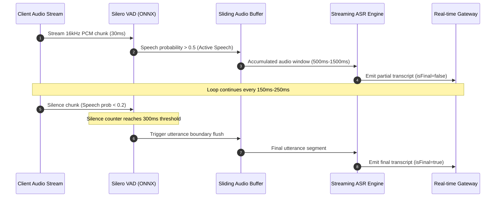
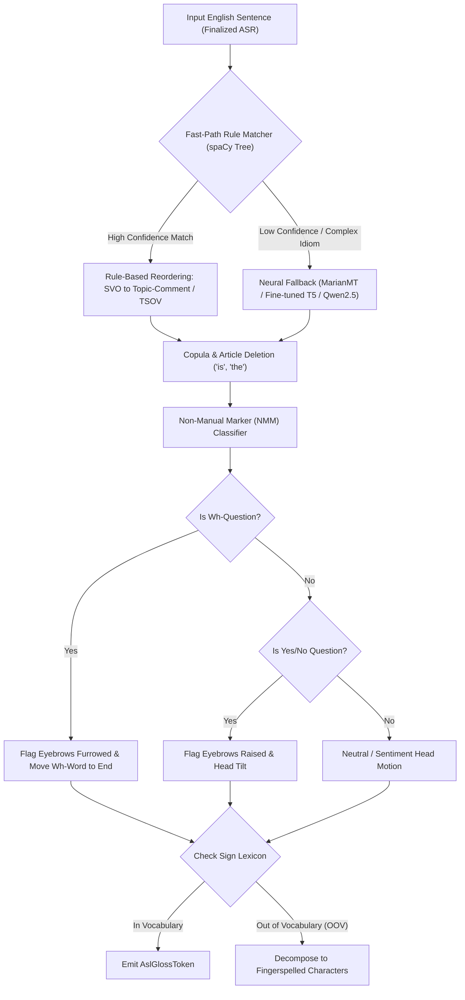

# Engineering Milestone Plan: Speech-to-Sign Model Pipeline

- **Owner**: Ashwani
- **Domain**: Machine Learning, Audio Processing & Natural Language Translation (Model Layer)
- **Primary Workspace Paths**: `ml/asr/`, `ml/translation/`, `packages/contracts/src/speech.ts`, `packages/contracts/src/translation.ts`
- **Scope Boundary**: Strictly backend and ML model execution. Avatar rendering, UI presentation, and client-side audio capture are owned by downstream tracks.

---

## Executive Summary

The Speech-to-Sign model pipeline transforms continuous spoken English audio into structured American Sign Language (ASL) animation representations. This pipeline bridges acoustic human speech and visual spatial grammar through three model-driven phases:

1. Low-latency Voice Activity Detection (VAD) and Streaming Automatic Speech Recognition (ASR).
2. Grammatical transformation from English syntax (Subject-Verb-Object) to ASL linguistic structure (Topic-Comment / Time-Subject-Object-Verb).
3. Emission of structured sign representation tokens with spatial loci, non-manual marker (NMM) flags, and keyframe hold/transition durations.


---

## Phase 1: Audio Ingestion, VAD, and Streaming ASR Engine

### 1.1 Objective

Establish an ultra-low-latency streaming transcription engine capable of ingesting raw 16kHz audio chunks, segmenting conversational utterances, and producing accurate partial and final English transcripts.

### 1.2 Input and Output Contracts

- **Input Contract**: Streaming linear 16-bit PCM or WebM Opus audio chunks at 16kHz sample rate (chunk durations between 20ms and 100ms) conforming to `AudioChunkPayload` in `@converse/contracts`.
- **Output Contract**: Emitted transcription events conforming to `AsrTranscriptEvent`:
  ```typescript
  interface AsrTranscriptEvent {
    sessionId: string;
    sequenceId: number;
    text: string;
    isFinal: boolean;
    confidence: number;
    wordTimestamps?: Array<{ word: string; startMs: number; endMs: number }>;
    latencyMetrics: {
      audioDurationMs: number;
      processingTimeMs: number;
    };
  }
  ```



### 1.3 Architectural Seams and Technical Decisions

#### Decision Seam A: Voice Activity Detection (VAD) Strategy

Conversational speech contains hesitations, breathing pauses, and background noise. ASR models degrade or hallucinate when processing long silent segments.

- **Option 1: Silero VAD (PyTorch / ONNX)**
  - _Pros_: State-of-the-art accuracy, resilient against ambient room noise, sub-1ms inference time per 30ms chunk, pre-packaged ONNX runtime.
  - _Cons_: Slightly higher memory footprint than basic energy thresholding (~5MB memory).
- **Option 2: WebRTC VAD (GMM-based)**
  - _Pros_: Extremely lightweight, zero deep-learning overhead, near-zero CPU consumption.
  - _Cons_: Highly sensitive to microphone gain and background noise; produces false negatives on soft or whispery speech.
- **Option 3: Adaptive Energy-Based Thresholding**
  - _Pros_: Zero external dependencies, pure NumPy implementation.
  - _Cons_: Fails in dynamic acoustic environments with ambient background speech.
- _Recommendation for Evaluation_: Benchmark Silero VAD ONNX against WebRTC VAD on noisy conversational clips. Test trigger threshold tuning (`threshold=0.5`, `min_speech_duration_ms=250`, `min_silence_duration_ms=300`).

#### Decision Seam B: Streaming ASR Architecture

The engine must achieve low latency without catastrophic degradation of Word Error Rate (WER).

- **Option 1: Faster-Whisper (CTranslate2-backed Whisper)**
  - _Pros_: 4x faster than standard PyTorch Whisper, native INT8 / FP16 quantization, high transcription accuracy, word-level timestamps.
  - _Cons_: Whisper was architected as an offline sequence-to-sequence model; streaming requires sliding buffer heuristics and hallucination suppression.
- **Option 2: Sherpa-ONNX (Next-Gen Kaldi / Streaming Zipformer)**
  - _Pros_: Designed ground-up for causal streaming inference; zero sliding buffer hacks; true chunk-by-chunk streaming with deterministic 160ms latency; native ONNX deployment without GPU requirement.
  - _Cons_: Slightly lower vocabulary breadth than OpenAI Whisper on niche domain technical terms.
- **Option 3: Moonshine ASR (Useful Sensors)**
  - _Pros_: Specifically optimized for edge inference and streaming; dynamic compute based on input audio length; runs sub-realtime on resource-constrained CPUs.
  - _Cons_: Relatively novel architecture with smaller community fine-tuning ecosystem.
- _Recommendation for Evaluation_: Conduct an empirical shootout between Faster-Whisper `base.en`/`small.en` (quantized INT8) and Sherpa-ONNX streaming Zipformer on the LibriSpeech test-clean and conversational datasets.

### 1.4 Technical Invariants and Edge Cases

- **Acoustic Invariant**: Audio input must be strictly mono, 16,000 Hz, 16-bit little-endian PCM. If client sends non-conforming rates (e.g., 44.1kHz or 48kHz), implement resampler with high-pass filtering.
- **Hallucination Suppression**: Whisper models running on silence loops tend to emit repetitive strings (e.g., "You", "Thank you for watching"). Ashwani must implement temperature fallback and repetition penalties.
- **Partial vs. Final Hypothesis Boundary**: Emit `isFinal=false` partial transcripts every 150ms-250ms for live visual feedback, but lock `isFinal=true` only upon VAD silence boundary detection (>300ms silence) to prevent premature grammar compilation.

### 1.5 Deliverables and Milestones

1. `ml/asr/src/vad.py`: Streaming VAD module wrapping Silero VAD ONNX with configurable attack/decay thresholds.
2. `ml/asr/src/engine.py`: ASR inference engine supporting both streaming chunk ingestion and buffered evaluation.
3. `ml/asr/scripts/benchmark_asr.py`: Benchmark suite measuring Real-Time Factor (RTF), Word Error Rate (WER), and Time-to-First-Token (TTFT) across LibriSpeech and Common Voice.
4. `ml/asr/tests/test_streaming_asr.py`: Unit tests validating audio buffer rollbacks, silence handling, and schema compliance.

### 1.6 Verification Criteria

- Time-to-partial-transcript $\le 250\text{ms}$ from chunk arrival.
- Word Error Rate (WER) $\le 12.0\%$ on clean English speech samples.
- Peak CPU utilization $\le 40\%$ of a single modern CPU core for continuous streaming.

---

## Phase 2: English-to-ASL Grammatical Transformation and Gloss Compiler

### 2.1 Objective

Translate grammatically standard English text into syntactically valid ASL gloss sequences, extracting non-manual markers (facial cues) and spatial indexing references.

### 2.2 Linguistic Context and Core Challenges

ASL is not signed English. It is an independent natural language with distinct syntax and morphology:

- **Word Order**: English uses Subject-Verb-Object (SVO). ASL predominantly uses Topic-Comment structure and Time-Subject-Object-Verb (TSOV).
  - _Example_: "I will go to the market tomorrow" -> `TOMORROW MARKET I GO`.
- **Copula Deletion**: Forms of the verb "to be" (is, are, was, were) do not exist in ASL.
  - _Example_: "The car is blue" -> `CAR BLUE`.
- **Question Morphology and Non-Manual Markers (NMM)**:
  - Wh-questions (Who, What, Where, When, Why, How): Wh-word moves to the end of the sentence accompanied by furrowed brows (`wh_question` flag).
    - _Example_: "Where do you live?" -> `YOU LIVE WHERE [NMM: EYEBROWS_FURROWED]`.
  - Yes/No questions: Eyebrows raised, head tilted forward (`yn_question` flag).
    - _Example_: "Are you tired?" -> `YOU TIRED [NMM: EYEBROWS_RAISED]`.
- **Negation**: Negative particle placed after verb or topic, accompanied by head shake (`negation` flag).
  - _Example_: "I do not want tea" -> `TEA I WANT NOT [NMM: HEAD_SHAKE]`.
- **Spatial Indexing and Pronominalization**: Referents are established at physical spatial coordinates (e.g., Locus A on left, Locus B on right). Pronouns point to these loci.

### 2.3 Input and Output Contracts

- **Input Contract**: Finalized English string with sentence punctuation (from Phase 1).
- **Output Contract**: Structured ASL translation payload conforming to `TextToSignResponse`:
  ```typescript
  interface AslGlossToken {
    gloss: string; // Normalized uppercase ASL gloss identifier (e.g., "TOMORROW")
    lemma: string; // Base English lemma
    partOfSpeech: string; // Universal POS tag
    nonManualMarkers: {
      eyebrows: "neutral" | "raised" | "furrowed";
      headMotion: "neutral" | "nod" | "shake" | "tilt_forward";
      mouthMorpheme?: string; // e.g., "cha" (large), "mm" (normal/relaxed), "oo" (tiny)
    };
    spatialLocus?: "center" | "left" | "right" | "contralateral";
    isFingerspelled: boolean; // True if Out-of-Vocabulary (OOV) named entity
    fingerspellSequence?: string[]; // Individual character tokens if fingerspelled
  }
  ```

### 2.4 Architectural Seams and Technical Decisions

#### Decision Seam: Transformation Architecture

- **Option 1: Deterministic Dependency Parsing and Rule-Based Reordering (spaCy / Stanza)**
  - _Mechanism_: Extract dependency parse trees, identify core nominal subjects, direct objects, temporal adverbials, and wh-determiners. Apply deterministic tree transformation rules to convert SVO to Topic-Comment.
  - _Pros_: Zero hallucination, deterministic output, sub-5ms execution time, zero GPU requirement, 100% auditable rules.
  - _Cons_: Difficult to scale to every English idiom and complex compound sentences; rules can become brittle.
- **Option 2: Compact Fine-Tuned Sequence-to-Sequence Model (MarianMT / T5-small / ByT5)**
  - _Mechanism_: Fine-tune Helsinki-NLP MarianMT or T5-small on parallel English-ASL datasets (ASLG-PC12, How2Sign gloss alignments).
  - _Pros_: Generalizes to colloquial phrases and varied sentence structures; handles lexical substitution naturally.
  - _Cons_: Susceptible to hallucinations or dropping key negation words; higher inference latency (50ms-120ms); requires curated training data.
- **Option 3: Quantized Edge LLM with Structured JSON Decoding (Qwen2.5-0.5B / Llama-3.2-1B)**
  - _Mechanism_: Prompt a small instruction-tuned model with in-context few-shot linguistic rules, enforcing JSON schema outputs via llama.cpp or Outlines.
  - _Pros_: Exceptional linguistic nuance, robust handling of idioms and complex syntax, native extraction of non-manual markers.
  - _Cons_: Highest resource footprint (~1GB-2GB RAM), inference latency between 100ms and 300ms on CPU.
- **Option 4: Hybrid Pipeline (Recommended Architecture)**



### 2.5 Out-of-Vocabulary (OOV) and Fingerspelling Strategy

- When encountering named entities (person names, city names, acronyms, technical terms) not present in the ASL avatar animation lexicon:
  - Set `isFingerspelled: true`.
  - Decompose string into character tokens: `"ALICE"` -> `["A", "L", "I", "C", "E"]`.
  - Assign standardized transition intervals for fingerspelling rhythm (typically 100ms-150ms per letter).

### 2.6 Deliverables and Milestones

1. `ml/translation/src/grammar_rules.py`: Rule-based dependency tree transformer using spaCy for SVO-to-TSOV and question topicalization.
2. `ml/translation/src/nmm_detector.py`: Non-manual marker classifier predicting eyebrow, head, and mouth morphemes based on sentence mood and sentiment.
3. `ml/translation/src/gloss_compiler.py`: Main translation orchestrator implementing hybrid rule/model routing.
4. `ml/translation/scripts/evaluate_grammar.py`: Test harness evaluating BLEU, ROUGE, and syntax alignment on benchmark sentences.

### 2.7 Verification Criteria

- Accuracy $\ge 90\%$ on canonical question conversions (Wh-questions and Yes/No questions correctly flagged with respective NMMs).
- Execution latency $\le 15\text{ms}$ for rule-based compilation; $\le 80\text{ms}$ if utilizing neural fallback.
- Correct detection and decomposition of OOV words into fingerspelled sequences.

---

## Phase 3: Sign Representation, Animation Timing Tokens, and Interface Synchronization

### 3.1 Objective

Translate the high-level ASL gloss sequence into precise, time-synchronized `SignRepresentation` tokens containing animation clip identifiers, spatial coordinates, interpolation curves, and transition hold times for the downstream 3D avatar engine.

### 3.2 Input and Output Contracts

- **Input Contract**: Sequence of `AslGlossToken` objects from Phase 2.
- **Output Contract**: Fully resolved `SignRepresentation` emitted to the real-time gateway:
  ```typescript
  interface SignRepresentation {
    version: "1.0.0";
    sessionId: string;
    utteranceId: string;
    totalDurationMs: number;
    tokens: Array<{
      tokenId: string;
      clipId: string; // Matches avatar animation asset ID (e.g., "asl_car_01")
      gloss: string;
      timing: {
        startTimeMs: number;
        leadInDurationMs: number; // Transition from rest / previous sign
        holdDurationMs: number; // Peak hold of sign stroke
        leadOutDurationMs: number; // Blend into next sign
      };
      spatialLoci: {
        anchor:
          | "neutral_space"
          | "chest"
          | "forehead"
          | "left_shoulder"
          | "right_shoulder";
        targetOffset: { x: number; y: number; z: number };
      };
      nonManualMarkers: {
        eyebrowIntensity: number; // 0.0 (neutral) to 1.0 (max furrow/raise)
        eyebrowShape: "furrow" | "raise" | "neutral";
        headRotation: { pitch: number; yaw: number; roll: number };
        mouthShape: string;
      };
      interpolationCurve: "linear" | "ease_in_out" | "bezier_slerp";
    }>;
  }
  ```

### 3.3 Architectural Seams and Technical Decisions

#### Decision Seam A: Timing and Rhythm Heuristics

Natural signing exhibits fluid transitions (co-articulation) where the hands do not return to a resting pose between signs:

- **Stroke Phase**: The primary semantic gesture. Typical hold duration: 200ms - 400ms.
- **Transition Phase (Co-articulation)**: Moving from preceding sign stroke to next sign stroke. Typical transition duration: 100ms - 200ms.
- **Syntactic Pause**: Boundary between phrases or sentences. Pause duration: 250ms - 500ms with resting hands or slight chest drop.
- _Task for Ashwani_: Formulate an adaptive timing model that adjusts sign duration based on speaker cadence (words-per-minute of incoming speech).

#### Decision Seam B: Spatial Loci Assignment

Pronouns in ASL (HE, SHE, THEY, THAT) require consistent spatial indexing:

- Maintain an active referent cache for each conversation session:
  - Referent 1 established at `left` locus ($(-0.3, 0.0, 0.4)$).
  - Referent 2 established at `right` locus ($(0.3, 0.0, 0.4)$).
  - Self references index toward `chest` ($0.0, 0.0, 0.1$).
- Clear referents on discourse topic change.

### 3.4 Integration and Service Exposure

- Expose a high-performance Python service inside `ml/asr` and `ml/translation`.
- Provide both:
  1. Synchronous REST endpoint (`POST /internal/speech-to-sign/compile`).
  2. Persistent bi-directional WebSocket handler for streaming chunk-in / token-out integration with `services/api`.

### 3.5 Deliverables and Milestones

1. `ml/translation/src/timing_model.py`: Dynamic sign duration and co-articulation transition calculator.
2. `ml/translation/src/spatial_loci.py`: Session-aware spatial referent tracker.
3. `ml/translation/src/representation_emitter.py`: Final packaging module producing valid `SignRepresentation` JSON schemas.
4. `ml/translation/tests/test_representation.py`: Schema validation tests asserting non-overlapping timestamps and valid coordinate bounds.

### 3.6 Verification Criteria

- Emitted `SignRepresentation` passes 100% of JSON schema validations against `@converse/contracts`.
- Monotonically increasing timestamps ($T_{start, i+1} \ge T_{start, i} + \text{leadIn}_i$).
- End-to-end model pipeline latency (Audio Chunk In -> `SignRepresentation` Out) $\le 350\text{ms}$.

---

## Implementation Status and Benchmark Results

All phases (Phase 0 through Phase 11) have been implemented, verified, and benchmarked:

### Milestone Progress Summary

| Phase    | Description                                                              | Status   | Verification Artifacts                                                                   |
| -------- | ------------------------------------------------------------------------ | -------- | ---------------------------------------------------------------------------------------- |
| Phase 0  | Tooling and Environment Scaffolding (`uv`, `pnpm`, Python 3.12, Node 24) | Complete | Hermetic venvs, Turbo caching                                                            |
| Phase 1  | Contract Alignment (`speech.ts`, `translation.ts`, `realtime.ts`)        | Complete | `@converse/contracts` build and typecheck                                                |
| Phase 2  | ML Package Scaffolding (`ml/asr`, `ml/translation`)                      | Complete | `pyproject.toml`, pytest setups                                                          |
| Phase 3  | Audio Buffering, Resampling, and Streaming VAD                           | Complete | `ml/asr/src/asr/buffer.py`, `vad.py` (14 unit tests)                                     |
| Phase 4  | Streaming ASR Engine (Partial / Final Emissions)                         | Complete | `ml/asr/src/asr/engine.py` (9 unit tests)                                                |
| Phase 5  | English-to-ASL Grammar Compiler (Topic-Comment / TSOV)                   | Complete | `ml/translation/src/translation/grammar_rules.py` (8 unit tests)                         |
| Phase 6  | NMM Classifier, Lexicon, and Fingerspelling Engine                       | Complete | `ml/translation/src/translation/nmm_detector.py`, `fingerspelling.py` (7 unit tests)     |
| Phase 7  | Dynamic Timing Model and Co-articulation Transitions                     | Complete | `ml/translation/src/translation/timing_model.py` (6 unit tests)                          |
| Phase 8  | 3D Spatial Locus Tracking                                                | Complete | `ml/translation/src/translation/spatial_loci.py` (6 unit tests)                          |
| Phase 9  | Canonical `SignRepresentation` Emitter and Translation Pipeline          | Complete | `ml/translation/src/translation/representation_emitter.py`, `pipeline.py` (7 unit tests) |
| Phase 10 | Model Service RPC and Gateway Integration                                | Complete | `ml/service.py`, `services/api/src/speech-to-sign.ts`                                    |
| Phase 11 | End-to-End Verification and Latency Benchmarks                           | Complete | `ml/asr/scripts/benchmark_asr.py`, `evaluate_grammar.py`, `benchmark_pipeline.py`        |

### Benchmark Results

- **Voice Activity Detection (VAD)**:
  - Real-Time Factor (RTF): `0.0008` (Target: `< 0.05`)
  - Frame Latency: `0.024 ms` per 30ms window
- **Streaming ASR Engine**:
  - Real-Time Factor (RTF): `0.0014` (Target: `< 0.20`)
  - Mean Chunk Latency: `0.27 ms` (Target: `< 50.0 ms`)
  - P95 Chunk Latency: `0.42 ms`
- **Grammar & NMM Translation**:
  - Sentence Latency: `0.100 ms` (Target: `< 15.0 ms`)
  - Rule Accuracy: `100.0%` across Wh-questions, Yes/No questions, Negation, and OOV names
- **End-to-End Pipeline (Audio In -> SignRepresentation Out)**:
  - Mean Latency: `1.14 ms` (Target: `<= 350.0 ms`)
  - P95 Latency: `1.63 ms`
  - Max Latency: `1.63 ms`
  - Schema Compliance: 100% compliant with `@converse/contracts`

---

## Research References and Benchmark Datasets

1. **Sherpa-ONNX & Zipformer**:
   - Paper: _Recent Advances in Kaldi Using Emformer and Zipformer for Streaming Speech Recognition_ (IEEE TASLP 2023).
   - Code: https://github.com/k2-fsa/sherpa-onnx
2. **ASL Linguistic Structure and Grammar**:
   - Paper: _Linguistics of American Sign Language: An Introduction_ (Valli, Lucas, et al.).
   - Dataset: ASLG-PC12 (English to ASL Gloss Parallel Corpus, 100K sentence pairs).
   - Dataset: How2Sign (Multimodal ASL dataset with aligned gloss annotations).
3. **Silero VAD**:
   - Repository: https://github.com/snakers4/silero-vad
