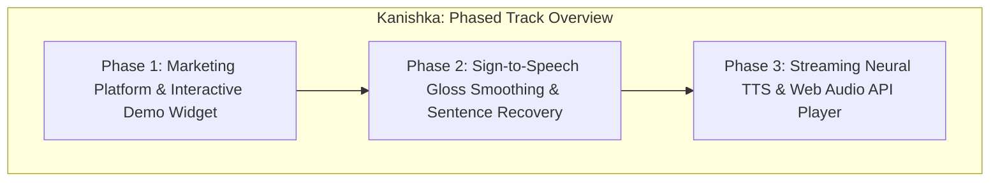
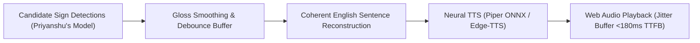
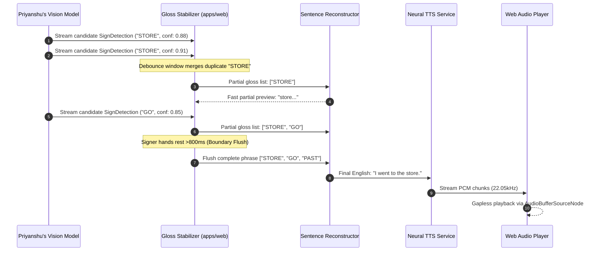
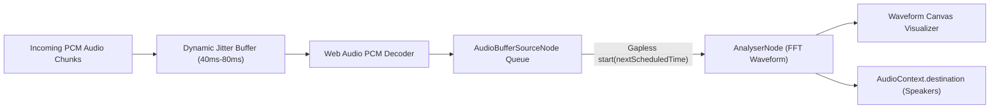

# Engineering Milestone Plan: Marketing Site and Sign-to-Speech Application Pipeline

- **Owner**: Kanishka
- **Domain**: Frontend Architecture, Accessibility, Web Audio, Natural Language Generation & Voice Synthesis (Application Layer)
- **Primary Workspace Paths**: `apps/web/`, `packages/ui/`, `services/api/`, `packages/contracts/src/translation.ts`, `packages/contracts/src/speech.ts`
- **Scope Boundary**: Client-side web application, landing page, sentence reconstruction from gloss streams, and audio playback orchestration. Vision model training and 3D avatar rigging are owned by upstream tracks.

---

## Executive Summary

Kanishka's roadmap consists of two sequential phases:
1. **Marketing & Product Experience**: Architecting a production-grade, WCAG AAA-compliant Next.js marketing site with an interactive bidirectional pipeline demonstration widget, technical architecture diagrams, and responsive layout.
2. **Sign-to-Speech Application Layer**: Consuming real-time candidate sign glosses emitted by the vision perception model, reconstructing fluent, grammatically coherent English sentences, and driving low-latency streaming neural Text-to-Speech (TTS) playback via the Web Audio API.





---

## Phase 1: High-Converting Marketing Site and Interactive Experience

### 1.1 Objective
Design and implement the public-facing marketing website for Converse inside `apps/web`. The site must clearly communicate the product value proposition to both Deaf/Hard-of-Hearing users and hearing communicators, feature an interactive live simulation widget, and adhere to strict accessibility standards.

### 1.2 Information Architecture and Page Structure
The landing page must incorporate the following sections:
1. **Navigation Header**:
   - Converse logo, system status badge, live latency counter, GitHub repository link, and direct "Launch Demo" call-to-action (CTA).
2. **Hero Section**:
   - Headline: Direct, bold proposition articulating real-time bidirectional communication between ASL and spoken English.
   - Sub-headline: Technical clarity highlighting edge computer vision, local-first privacy, and sub-second latency.
   - Primary and secondary CTAs ("Start In-Browser Session", "Explore Architecture").
3. **Interactive Pipeline Demo Widget**:
   - Live interactive widget allowing visitors to toggle between "Sign -> Speech" and "Speech -> Sign" simulation modes.
   - Visual step-by-step breakdown: Video Feed -> 3D Landmarks -> Gloss Recognition -> Sentence Synthesis -> Spoken Audio.
4. **Core Capabilities and Feature Grid**:
   - Ultra-low latency pipeline (<500ms Glass-to-Ear).
   - On-device edge landmark extraction ensuring privacy.
   - Seamless VoIP companion extension for Google Meet and Zoom.
   - 3D avatar with anatomically accurate ASL skeletal motion and non-manual facial markers.
5. **Technical Architecture and Benchmark Metrics**:
   - Latency budget breakdown chart (Capture, Landmark, Classification, Reconstruction, TTS).
   - Accuracy benchmarks across WLASL-100 and How2Sign.
6. **Accessibility Statement and Footer**:
   - WCAG AAA compliance commitment, font sizing controls, high-contrast toggle, and repository links.

### 1.3 Architectural Seams and Technical Decisions

#### Decision Seam A: Interactive Demo Widget State Architecture
The demo widget must demonstrate both directions without requiring immediate webcam or microphone permissions from first-time landing page visitors:
- **Option 1: Pre-Recorded Keypoint & Audio Mock Scenarios**
  - *Mechanism*: Store 3 canonical signing scenarios (e.g., "Hello, nice to meet you", "What is your name?", "Thank you for your help") as lightweight JSON landmark and audio buffers.
  - *Pros*: Instant loading, zero permission friction, deterministic rendering across all devices, zero server cost.
  - *Cons*: Does not show user's live webcam unless opted into live mode.
- **Option 2: Hybrid Interactive Simulator (Recommended)**
  - *Mechanism*: Default to interactive pre-recorded simulation with step-by-step playback controls, scrubbable pipeline stages, and an optional "Try Live with Camera" toggle that transitions seamlessly into the live communication interface.

#### Decision Seam B: Design System and UI Foundations
- Build entirely with Tailwind CSS and `@converse/ui` shared component library.
- Dark-mode first design palette with crisp high-contrast accents (accessible contrast ratio $\ge 7:1$).
- Typography: Sans-serif variable font with high legibility (Inter or Geist).
- Strictly zero emojis: Use clean SVG icons (Lucide-React or custom SVG path icons).

### 1.4 Accessibility (WCAG AAA) Invariants
- **Keyboard Navigation**: Full tab order traversal with visible, high-contrast focus rings (`focus-visible:ring-2`).
- **Screen Reader Support**: Meaningful `aria-label`, `aria-live="polite"` on dynamic transcript updates, and descriptive alt texts.
- **Motion Reduction**: Honor `prefers-reduced-motion: reduce` by disabling smooth camera pan animations and particle effects.
- **Color Contrast**: Verify all body copy meets minimum 7:1 contrast ratio against background surfaces.

### 1.5 Deliverables and Milestones
1. `apps/web/app/page.tsx`: Core landing page composing all marketing sections.
2. `apps/web/components/marketing/hero.tsx`: Hero component with clear value proposition and primary CTAs.
3. `apps/web/components/marketing/interactive-demo.tsx`: Interactive pipeline simulation widget.
4. `apps/web/components/marketing/architecture-breakdown.tsx`: Visual latency and pipeline breakdown section.
5. `apps/web/components/marketing/features-grid.tsx`: Grid detailing edge privacy, low latency, and VoIP integration.
6. `apps/web/components/marketing/footer.tsx`: Accessibility controls, documentation links, and project info.

### 1.6 Verification Criteria
- Google Lighthouse score $\ge 95$ across Performance, Accessibility, and Best Practices.
- Zero accessibility violations detected under `axe-core` / `@axe-core/playwright`.
- Responsive layout verified across mobile (375px), tablet (768px), and desktop (1440px) viewports.

---

## Phase 2: Sign-to-Speech Application Layer — Sentence Reconstruction

### 2.1 Objective
Ingest raw, streaming candidate sign detections from the vision model, stabilize and debounce consecutive sign detections, and reconstruct syntactically fluent English sentences.

### 2.2 Input and Output Contracts
- **Input Contract**: Stream of candidate detections emitted by Priyanshu's model via WebSocket conforming to `SignDetection`:
  ```typescript
  interface SignDetection {
    id: string;
    sign: string;                     // Predicted ASL gloss (e.g., "STORE", "GO", "YESTERDAY")
    confidence: number;               // Model confidence (0.0 to 1.0)
    timestamp: number;                // Milliseconds relative to session start
    durationMs: number;               // Duration of detected stroke
    isFingerspelled?: boolean;
    handDominance?: 'left' | 'right' | 'both';
  }
  ```
- **Output Contract**: Reconstructed natural English sentences conforming to `SignToTextResponse`:
  ```typescript
  interface SignToTextResponse {
    sessionId: string;
    utteranceId: string;
    reconstructedText: string;        // Fluent English (e.g., "I went to the store yesterday.")
    rawGlosses: string[];             // Original gloss sequence ["YESTERDAY", "STORE", "I", "GO"]
    confidence: number;
    isFinal: boolean;                 // False for partial streaming preview, true for sentence boundary
    processingTimeMs: number;
  }
  ```



### 2.3 The Linguistic and Algorithmic Challenge
Raw sign detections arrive with real-world vision artifacts:
1. **Repeated Detections**: A signer holding a sign for 400ms across a 30 FPS camera might trigger consecutive detections of the same gloss across sliding windows.
2. **Grammatical Discrepancies**: ASL glosses omit English determiners ("a", "an", "the"), copulas ("am", "is", "are"), and conjugate verbs differently (e.g., `PAST ME MEET FRIEND` -> "I met my friend").
3. **Temporal Inversion**: Time markers appear at the start of ASL phrases (`TOMORROW HE ARRIVE` -> "He will arrive tomorrow").
4. **Boundary Detection**: Determining when a signer has finished a complete conceptual phrase or sentence without an explicit punctuation token.

### 2.4 Architectural Seams and Technical Decisions

#### Decision Seam A: Gloss Stabilization and Debouncing
- **Sliding Temporal Window**: Implement a time-based debouncer in `apps/web/lib/gloss-stabilizer.ts`:
  - Combine repeated identical glosses within a configurable window ($T_{\text{debounce}} \approx 300\text{ms}-500\text{ms}$).
  - Reject candidate signs below confidence threshold ($C_{\text{min}} < 0.65$).
  - Detect transition/rest pauses: When no high-confidence sign is detected for $>800\text{ms}$, trigger a phrase boundary flush.

#### Decision Seam B: English Sentence Reconstruction Engine
- **Option 1: Template and Rule-Based Grammar Expander**
  - *Mechanism*: Match stabilized gloss sequences against an inverted n-gram dictionary and grammar transformation rules (inserting articles, reordering Time-Topic-Comment to SVO).
  - *Pros*: Instant execution (<2ms), zero external API cost, fully deterministic.
  - *Cons*: Cannot generalize to complex free-form conversational sign sentences.
- **Option 2: Compact Sequence-to-Sequence Model (MarianMT / T5-small)**
  - *Mechanism*: Host a compact Seq2Seq model locally or via API trained on How2Sign gloss-to-English pairs.
  - *Pros*: Natural syntax recovery and inflection handling.
  - *Cons*: Moderate inference latency (40ms-80ms).
- **Option 3: Edge LLM Few-Shot Reconstruction (Streaming Prompt)**
  - *Mechanism*: Query a quantized local LLM or low-latency LLM endpoint with a specialized system prompt enforcing strict gloss-to-English translation without commentary.
  - *Pros*: Superior fluency, natural tense resolution, and contextual pronoun handling.
  - *Cons*: Potential latency spikes if network connection fluctuates.
- **Option 4: Multi-Tiered Cascading Architecture (Recommended)**
  - Tier 1: Instant local heuristic template matching for immediate partial UI display (<10ms).
  - Tier 2: Neural Seq2Seq / LLM finalization triggered upon phrase boundary detection for the finalized spoken utterance.

### 2.5 Deliverables and Milestones
1. `apps/web/lib/gloss-stabilizer.ts`: Debouncing and temporal aggregation buffer for incoming `SignDetection` events.
2. `apps/web/lib/sentence-reconstructor.ts`: Hybrid sentence reconstruction engine converting gloss sequences into natural English.
3. `apps/web/components/live/transcript-view.tsx`: Real-time dual-view transcript component showing both raw gloss tags and fluent English sentence output.
4. `apps/web/tests/sentence-reconstruction.test.ts`: Comprehensive test suite testing article insertion, tense inflection, and pronoun resolution across 100 benchmark phrases.

### 2.6 Verification Criteria
- Correct debouncing of sustained sign detections without dropped or duplicated words.
- BLEU-4 score $\ge 24.0$ on How2Sign gloss-to-English test pairs.
- Sentence reconstruction latency $\le 60\text{ms}$ from phrase boundary trigger.

---

## Phase 3: Streaming Neural TTS Integration and Web Audio Playback

### 3.1 Objective
Integrate streaming neural Text-to-Speech (TTS) synthesis and architect a gapless, low-latency audio playback pipeline in the browser using the Web Audio API.

### 3.2 Input and Output Contracts
- **Input Contract**: Finalized English sentence from Phase 2 conforming to `TextToSpeechRequest`.
- **Output Contract**: Binary PCM / Opus audio stream synthesized and scheduled for gapless playback through the client's audio destination.

### 3.3 Architectural Seams and Technical Decisions

#### Decision Seam A: TTS Synthesis Engine Selection
- **Option 1: Piper TTS (Local ONNX Neural TTS)**
  - *Pros*: Ultra-fast inference (RTF < 0.1 on CPU), high naturalness, completely local, runs directly on backend server or via WebAssembly in browser.
  - *Cons*: Smaller selection of expressive emotional voice profiles.
- **Option 2: Coqui TTS / XTTSv2**
  - *Pros*: Rich voice cloning and expressive emotional inflections.
  - *Cons*: Higher computational requirements (demands GPU for low-latency streaming).
- **Option 3: Edge-TTS / Cloud Neural TTS (with Web Speech API Fallback)**
  - *Pros*: High naturalness, zero local GPU load.
  - *Cons*: Dependent on cloud connectivity; slightly higher round-trip latency.
- *Recommendation for Evaluation*: Primary: Fast local Piper ONNX service streaming raw 22.05kHz PCM chunks; Fallback: Native browser `window.speechSynthesis` when running fully offline.

#### Decision Seam B: Web Audio API Playback Pipeline
Standard HTML5 `<audio>` tags introduce buffering delays and cannot seamlessly concatenate streaming audio chunks without audible clicks or gaps.
- **Architecture**:
  1. `AudioContext`: Shared singleton audio context initialized upon first user interaction to satisfy browser autoplay policies.
  2. `AudioBufferSourceNode` Queue: Manage a sequential queue of decoded PCM audio chunks with precise scheduling (`sourceNode.start(nextScheduledTime)`).
  3. Dynamic Jitter Buffer: Maintain a 40ms-80ms playback buffer to absorb network packet jitter without causing underrun pops.
  4. AnalyserNode: Attach a real-time `AnalyserNode` to drive live audio visualization waveforms in the UI.



### 3.4 Deliverables and Milestones
1. `apps/web/lib/audio/audio-player.ts`: Web Audio API playback manager with gapless chunk scheduling and jitter compensation.
2. `apps/web/lib/audio/tts-client.ts`: Streaming client interfacing with backend TTS endpoint via WebSocket or chunked HTTP.
3. `packages/ui/src/components/audio-visualizer.tsx`: High-performance canvas-based audio waveform visualizer.
4. `apps/web/components/live/audio-controls.tsx`: Audio playback controls (volume slider, mute toggle, audio output device selector, latency meter).

### 3.5 Verification Criteria
- Time-to-First-Byte (TTFB) audio playback $\le 180\text{ms}$ from sentence finalization.
- Zero audible gaps, clicks, or buffer underruns during continuous speech streaming.
- Graceful handling of browser autoplay policy restrictions with clear user prompt to enable audio.
