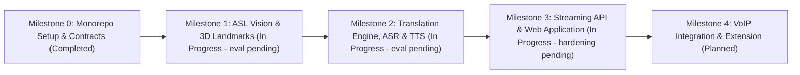

# Roadmap and Milestones

This document tracks the technical execution plan, deliverables, completion criteria, and verification procedures for Converse across Milestones 0 through 4.



---

## Milestone 0: Monorepo Setup and Invariant Contracts

### Objective
Establish the hybrid monorepo foundation, development tooling, strict typing, CI/CD validation gates, and cross-boundary interface contracts.

### Status
Completed

### Deliverables
- Monorepo orchestration configured with `pnpm` workspaces and Turborepo (`turbo.json`).
- Python ML workspace configured with `uv` isolation under `ml/asl-vision`, `ml/asr`, `ml/translation`, and `ml/tts`.
- Shared contracts package (`@converse/contracts`) exporting canonical data structures:
  - Coordinate primitives: `Point3D`.
  - Landmark representations: `HandLandmarks`, `PoseLandmarks`, `FrameLandmarks`.
  - Vision detections: `SignDetection`.
  - Translation requests and responses: `SignToTextRequest`, `SignToTextResponse`, `TextToSignRequest`, `TextToSignResponse`.
  - Speech payloads: `SpeechToTextRequest`, `SpeechToTextResponse`, `TextToSpeechRequest`, `TextToSpeechResponse`.
  - Real-time protocol definitions: `RealtimeMessage`, `SessionInitPayload`, `RealtimeDirection`.
  - Rust-inspired error handling: `Result<T, E>` and `Option<T>`.
- Express.js API gateway skeleton under `services/api` with typed routes and health check endpoint (`/health`).
- Root linting (ESLint, Ruff), formatting (Prettier, EditorConfig), and TypeScript base configurations (`@converse/typescript-config`).

### Completion Criteria
- All TypeScript packages compile cleanly under `turbo run build` and `turbo run typecheck`.
- Python ML subprojects initialize without errors under `uv run pytest`.
- Zero circular dependencies across workspace packages.
- Strict typing enforced with no implicit `any`.

### Verification Steps
1. Execute full monorepo build:
   ```bash
   pnpm run build
   ```
2. Run TypeScript typechecking across all workspaces:
   ```bash
   pnpm run typecheck
   ```
3. Run linting across TypeScript and Python codebases:
   ```bash
   pnpm run lint
   cd ml/asl-vision && uv run ruff check .
   ```
4. Verify contracts package exports:
   ```bash
   node -e "import('@converse/contracts').then(() => console.log('contracts loaded successfully'))"
   ```

---

## Milestone 1: Core ASL Vision and Landmark Extraction Pipeline

### Objective
Build the client-edge and backend vision perception pipeline to extract 3D landmarks from video streams, normalize spatial coordinates, buffer temporal windows, and classify isolated ASL signs.

### Status
In Progress (perception hardening complete; quantitative eval pending)

### Implementation Notes
- `ASLVisionEngine` resolves pretrained `tgcn_asl100.bin` into `TGCNModel` by default with STGCN fallback (ADR-009).
- Inference gated on temporal motion variance (`>= 0.015`), wrist-stationary resting-pose detector (`> 300 ms`), and below-chest suppression.
- Sliding windows carry `motion_energy`, `variance`, and `is_idle` metadata.
- 156 `ml/asl-vision` tests passing, including static-ORANGE suppression and ONNX parity.
- Measured (CPU, synthetic windows, mock model): infer-step p50 ~0.00 ms, p95 0.27 ms, max 2.09 ms — inside the 45 ms budget excluding MediaPipe extraction.
- Offline eval on 10 real WLASL clips (`scripts/eval_wlasl_offline.py`): 0/10 Top-1 across a 12-way convention sweep (joint orders x normalizations x hand orders). Third-party `tgcn_asl100.bin` does not recognize MediaPipe-derived skeletons under any tested convention despite exact architecture match; joint order (BODY_25) and pixel-scale normalization fixed in code. Remediation: harvesting WLASL100 features through the live pipeline (`scripts/harvest_wlasl_features.py`) to train our own TGCN on matching features.
- Pending: MediaPipe FPS benchmark, and 70% Top-1 WLASL-100 eval on unseen signers (blocked on retraining).

### Deliverables
- Video frame ingestion worker supporting standard webcam inputs (640x480 resolution, 30 FPS).
- MediaPipe Holistic / Tasks Vision integration extracting:
  - 21 3D landmarks per hand (left and right).
  - 33 3D body pose landmarks.
  - Selected facial keypoints for non-manual grammatical cues.
- Coordinate normalization preprocessor:
  - Spatial centering relative to the primary wrist joint.
  - Bounding-box scale normalization to eliminate camera distance sensitivity.
  - Missing landmark imputation and Savitzky-Golay / One-Euro temporal smoothing.
- Temporal sequence buffer producing fixed-size sliding windows ($T=30$ and $T=60$ frames).
- Isolated sign recognition baseline model:
  - Spatial-Temporal Graph Convolutional Network (ST-GCN) or Temporal Convolutional Network (TCN).
  - Trained on WLASL subset (starting with WLASL-100 baseline, scaling to WLASL-1000).
- Offline dataset evaluation and preprocessing harness in `ml/asl-vision/scripts/`.

### Completion Criteria
- Landmark extraction operates at $\ge 25$ FPS on CPU and $\ge 30$ FPS with WebAssembly/GPU acceleration.
- Feature normalization guarantees scale and position invariance across varying camera distances.
- Baseline isolated sign classifier achieves $\ge 70\%$ Top-1 accuracy on WLASL-100 validation split with unseen signers.
- End-to-end vision pipeline latency (frame capture to sign detection) does not exceed 45ms.

### Verification Steps
1. Run landmark normalization unit tests:
   ```bash
   cd ml/asl-vision && uv run pytest tests/test_normalization.py
   ```
2. Benchmark landmark extraction throughput and inference latency:
   ```bash
   cd ml/asl-vision && uv run python scripts/benchmark_landmarks.py --input test_video.mp4
   ```
3. Evaluate model accuracy on unseen signer validation split:
   ```bash
   cd ml/asl-vision && uv run python scripts/evaluate_model.py --dataset wlasl100 --checkpoint checkpoints/best_stgcn.pt
   ```

---

## Milestone 2: Translation Engine (ASL Gloss <-> English) and ASR/TTS Integration

### Objective
Develop the bidirectional translation engine connecting ASL gloss sequences to fluent English, integrate low-latency streaming ASR (Speech-to-Text), and integrate natural neural TTS (Text-to-Speech).

### Status
In Progress (functional implementation complete; benchmark eval pending)

### Implementation Notes
- English-to-ASL grammar compiler with 1,500+ meeting lexicon, 3,200+ lemma map, and idiom normalization (46 translation tests passing).
- ASR backends behind `AsrEngineProtocol`: AWS Transcribe Streaming production default with Whisper local fallback, zero silent fallback (ADR-008).
- Native `converse-tts` Edge-TTS engine with `/internal/tts/synthesize` endpoint and gateway proxy (ADR-010); 8 TTS tests passing.
- Sentence reconstruction owned by `@converse/contracts` (ADR-011); 60 web reconstruction tests passing.
- Measured (CPU): translation `translate()` p50 0.05-0.12 ms across 5-12 word utterances; contracts `reconstructSentence` p50 0.001 ms — both far inside the 350 ms streaming budget.
- Pending: BLEU-4 on How2Sign, WER and 250 ms partial-transcript ASR benchmarks, and 180 ms TTS TTFB measurement.

### Deliverables
- Continuous sign language sequence processor handling sign boundaries and co-articulation.
- ASL Gloss to English translation module:
  - Sequence-to-sequence neural model (Transformer or fine-tuned compact LLM / MarianMT) trained on How2Sign parallel text data.
  - Handling spatial grammar and non-manual marker conditioning.
- English to ASL Gloss token compiler:
  - Rule-based and statistical reordering engine converting English syntax (Subject-Verb-Object) to ASL grammatical structure (Topic-Comment / Time-Subject-Object-Verb).
- Automatic Speech Recognition (ASR) service (`ml/asr`):
  - Streaming Whisper (Whisper-base / Whisper-small via Faster-Whisper/CTranslate2).
  - Integrated Silero VAD (Voice Activity Detection) for dynamic utterance segmentation.
- Text-to-Speech (TTS) service (`ml/tts`):
  - FastSpeech2 or ONNX-accelerated neural TTS engine (Coqui / Piper / Edge-TTS) streaming PCM audio chunks.

### Completion Criteria
- ASL Gloss to English translation achieves BLEU-4 score $\ge 22.0$ on the How2Sign evaluation split.
- English to ASL Gloss compilation produces syntactically valid gloss structures for top 500 conversational phrases.
- ASR service achieves Word Error Rate (WER) $< 12\%$ on clean speech with time-to-partial-transcript $< 250\text{ms}$.
- TTS service achieves time-to-first-audio-chunk (TTFB) $< 180\text{ms}$.

### Verification Steps
1. Validate translation accuracy against reference corpora:
   ```bash
   cd ml/translation && uv run python scripts/evaluate_translation.py --test-data data/how2sign_val.json
   ```
2. Benchmark ASR latency and Word Error Rate:
   ```bash
   cd ml/asr && uv run python scripts/benchmark_asr.py --audio-dir test_samples/
   ```
3. Benchmark TTS synthesis latency and audio fidelity:
   ```bash
   cd ml/tts && uv run python scripts/benchmark_tts.py --text "Hello, I am testing the Converse communication engine."
   ```
4. Verify TypeScript contract alignment in API adapters.

---

## Milestone 3: Real-Time Streaming API and Web Application

### Objective
Deliver the centralized real-time streaming infrastructure, WebSocket session management, and the interactive web application demonstrating bidirectional communication.

### Status
In Progress (functional implementation complete; hardening pending)

### Implementation Notes
- Room-based WebSocket gateway at `/ws/meeting` with `session_init`/`session_ready`, keepalive, and both-direction fan-out (ADR-011).
- `/meeting` dual-pane page: signer pane plus hearing pane with Three.js WebGL avatar; `pnpm build` renders `/`, `/_not-found`, `/meeting`.
- Pending: E2E latency budgets (500 ms sign-to-speech, 400 ms speech-to-sign), sub-3 s reconnect without state loss, and malformed-frame injection suite.

### Deliverables
- Express.js WebSocket gateway (`services/api`) implementing `@converse/protocol`:
  - Session initialization, heartbeat ping/pong, and error recovery.
  - Directional routing:
    - `sign_to_speech`: Landmark stream -> Vision service -> Translation engine -> TTS -> Client audio playback.
    - `speech_to_sign`: Audio chunk stream -> ASR service -> Translation engine -> Gloss tokens / Sign visualizer.
- End-to-end event orchestrator maintaining session state and performance metrics.
- Next.js Web Client (`apps/web`):
  - Real-time video canvas with landmark tracking visualizer.
  - Audio recording and playback controller with volume level meters.
  - Live transcript interface showing partial hypothesis, finalized sentences, and confidence indicators.
  - Diagnostic latency panel displaying Glass-to-Ear and Voice-to-Sign breakdown.

### Completion Criteria
- End-to-end latency for Sign-to-Speech (camera landmark capture to audio speaker output) $< 500\text{ms}$ under standard network conditions.
- End-to-end latency for Speech-to-Sign (audio capture to visual sign display) $< 400\text{ms}$.
- WebSocket gateway supports reconnection without dropping active session state during momentary disconnects ($< 3\text{s}$).
- Zero unhandled rejections or crashes during malformed frame injection tests.

### Verification Steps
1. Run API unit and integration test suite:
   ```bash
   pnpm --filter @converse/api test
   ```
2. Run end-to-end synthetic streaming test simulating concurrent video and audio clients:
   ```bash
   pnpm --filter @converse/api run test:streaming
   ```
3. Validate client bundle and component rendering in `apps/web`:
   ```bash
   pnpm --filter web build
   ```

---

## Milestone 4: VoIP Integration and Browser Extension

### Objective
Package Converse into a Chrome Manifest V3 extension and VoIP companion capable of overlaying real-time translation into live video calls (Google Meet, Zoom Web, Microsoft Teams).

### Status
Planned

### Deliverables
- Chrome Manifest V3 Extension (`apps/extension`):
  - Content scripts injecting into target conferencing web applications.
  - Off-screen document / canvas capture extracting video frames from DOM video elements.
  - Audio capture hooking remote peer audio streams.
  - Non-intrusive HUD overlay displaying real-time ASL transcriptions and signing cues.
  - Extension background service worker managing secure WebSocket tunnels to the Converse API.
- Virtual media stream routing:
  - Virtual microphone injector streaming synthesized TTS audio into meeting audio inputs.
  - Virtual camera / avatar canvas option for speech-to-sign playback.
- Hardened fault tolerance:
  - Network jitter buffer adapting to fluctuating VoIP bandwidth.
  - Graceful degradation when landmark confidence drops due to occlusion or poor call lighting.

### Completion Criteria
- Extension operates within Google Meet without decreasing host call frame rate below 25 FPS.
- Caption display latency within the meeting viewport $< 350\text{ms}$ from sign completion.
- Background service worker complies with Manifest V3 lifecycle constraints and memory caps.
- System maintains flat heap memory allocation across continuous 45-minute calls.

### Verification Steps
1. Run automated browser integration suite via Playwright:
   ```bash
   pnpm --filter extension test:e2e
   ```
2. Audit Chrome extension package compliance:
   ```bash
   pnpm --filter extension run audit:mv3
   ```
3. Execute continuous load test measuring memory leaks and socket reconnect behavior under packet loss.
