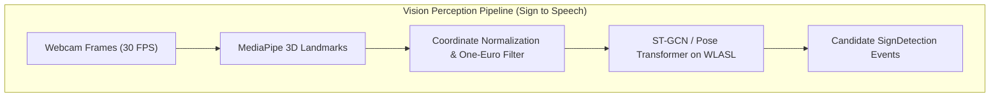
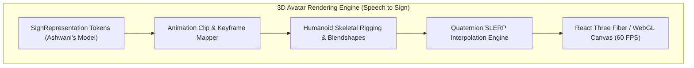
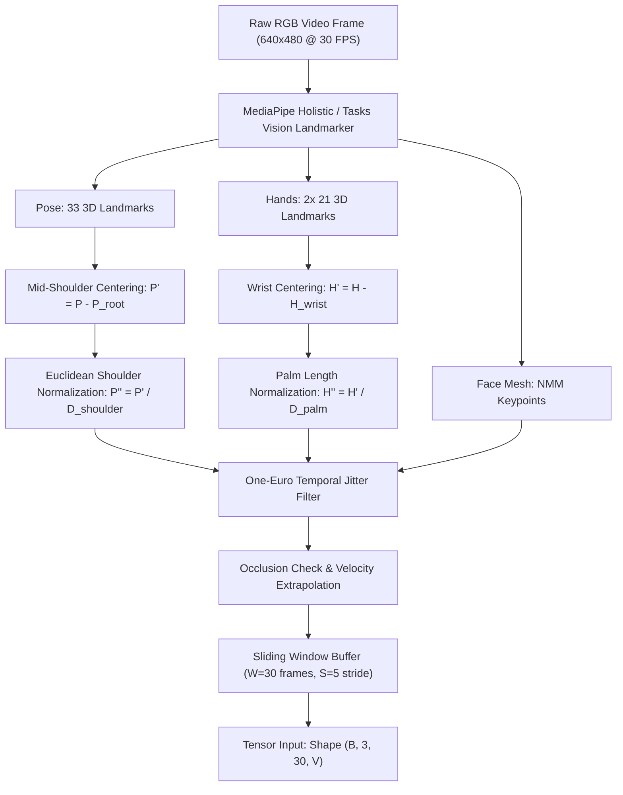
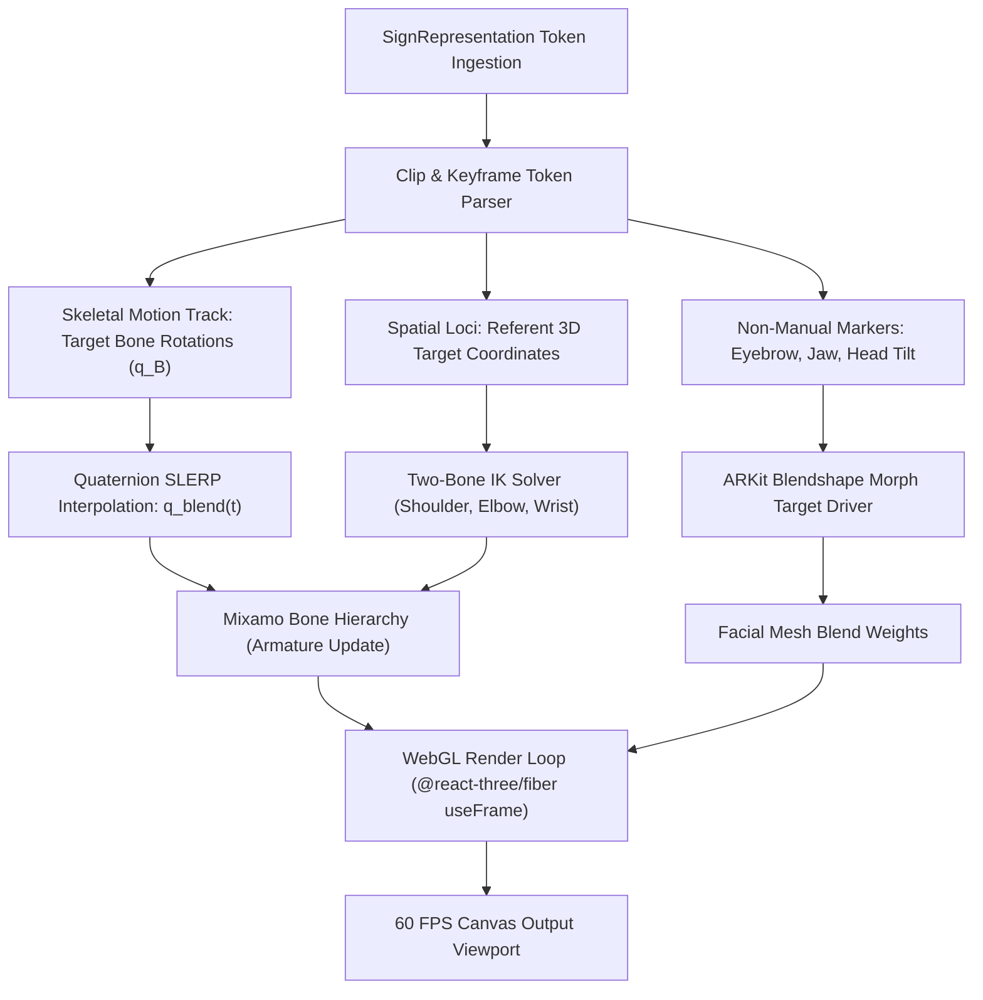

# Engineering Milestone Plan: Sign-to-Speech Model Pipeline and Speech-to-Sign 3D Avatar Engine

- **Owner**: Priyanshu
- **Domain**: Computer Vision, Deep Learning, 3D WebGL Graphics & Character Animation (Model Layer + Application Layer)
- **Primary Workspace Paths**: `ml/asl-vision/`, `apps/web/`, `packages/ui/`, `packages/contracts/src/landmarks.ts`, `packages/contracts/src/vision.ts`
- **Scope Boundary**: Dual-responsibility track spanning:
  1. The vision ML perception model (video camera input to candidate ASL gloss detection).
  2. The client-side 3D avatar rendering engine (ASL representation tokens to real-time 60 FPS WebGL skeletal animation).
- **Remaining / Unassigned Work Backlog**: See [remaining-work.md](remaining-work.md) for the detailed inventory of subsystems left out of current assignments.

---

## Executive Summary

Priyanshu anchors the bidirectional visual interface of Converse:
- **Vision Model Layer (Sign -> Speech)**: Ingests raw video frames, extracts 3D skeletal landmarks, normalizes coordinates to ensure scale and distance invariance, and classifies spatiotemporal gestures into candidate ASL glosses using graph neural networks or pose transformers.
- **Avatar Application Layer (Speech -> Sign)**: Ingests structured sign representation tokens emitted by Ashwani's model, loads rigged humanoid 3D meshes, drives bone rotations and facial blendshapes, and performs Spherical Linear Interpolation (SLERP) to render natural, expressive sign language at 60 FPS.





---

## Phase 1: Camera Ingestion, 3D Landmark Extraction, and Coordinate Normalization

### 1.1 Objective
Build a robust vision pre-processing pipeline that captures video frames, extracts high-fidelity 3D landmarks for hands, pose, and face, and applies mathematical normalization to guarantee scale, translation, and distance invariance.

### 1.2 Input and Output Contracts
- **Input Contract**: RGB camera stream (640x480 resolution @ 30 FPS).
- **Output Contract**: Normalized landmark frames conforming to `FrameLandmarks` in `@converse/contracts`:
  ```typescript
  interface FrameLandmarks {
    timestamp: number;
    frameIndex: number;
    poseLandmarks: Array<{ x: number; y: number; z: number; visibility?: number }>;
    leftHandLandmarks: Array<{ x: number; y: number; z: number }>;
    rightHandLandmarks: Array<{ x: number; y: number; z: number }>;
    faceLandmarks?: Array<{ x: number; y: number; z: number }>;
    normalizationMeta: {
      scaleFactor: number;
      rootJointOffset: { x: number; y: number; z: number };
    };
  }
  ```

### 1.3 Keypoint Topology
The pipeline requires precise anatomical tracking:
- **Hands**: 21 3D landmarks per hand (wrist, thumb CMC/MCP/IP/tip, index MCP/PIP/DIP/tip, middle MCP/PIP/DIP/tip, ring MCP/PIP/DIP/tip, pinky MCP/PIP/DIP/tip).
- **Pose (Upper Body)**: 33 body landmarks, specifically filtering for upper torso (shoulders, elbows, wrists, hips, neck).
- **Face Mesh**: Key facial contours used for grammatical Non-Manual Markers:
  - Eyebrow contours (left/right inner and outer eyebrow height for questions).
  - Lips and mouth contours (aperture and width for mouth morphemes).
  - Head rotation orientation (pitch, yaw, roll).

### 1.4 Mathematical Coordinate Normalization Invariants
Raw screen-space pixel coordinates are unusable for model generalization because signers sit at varying distances and angles from webcams. Priyanshu must implement three strict mathematical normalization steps:

1. **Translation Invariance (Root Joint Centering)**:
   Translate all coordinates relative to a fixed anatomical anchor point.
   - For upper body pose: Root joint is the midpoint between left and right shoulder joints:
     $$\mathbf{P}_{\text{root}} = \frac{\mathbf{P}_{\text{left\_shoulder}} + \mathbf{P}_{\text{right\_shoulder}}}{2}$$
     $$\mathbf{P}'_i = \mathbf{P}_i - \mathbf{P}_{\text{root}}$$
   - For isolated hand gestures: Center hand landmarks relative to the respective wrist joint:
     $$\mathbf{H}'_j = \mathbf{H}_j - \mathbf{H}_{\text{wrist}}$$

2. **Scale Invariance (Bounding Metric Normalization)**:
   Normalize coordinate magnitude using anatomical reference lengths:
   - For pose: Divide by the Euclidean distance between left and right shoulders ($D_{\text{shoulder}} = \|\mathbf{P}_{\text{left\_shoulder}} - \mathbf{P}_{\text{right\_shoulder}}\|$).
   - For hands: Divide by the distance between the wrist and middle finger MCP joint ($D_{\text{palm}} = \|\mathbf{H}_{\text{wrist}} - \mathbf{H}_{\text{middle\_mcp}}\|$).
   $$\mathbf{P}'' = \frac{\mathbf{P}'}{D_{\text{shoulder}}}, \quad \mathbf{H}'' = \frac{\mathbf{H}'}{D_{\text{palm}}}$$

3. **Temporal Jitter Smoothing and Missing Landmark Imputation**:
   Webcam noise and brief finger occlusions cause high-frequency coordinate jitter.
   - Implement a **One-Euro Filter** or **Savitzky-Golay filter** to preserve rapid ballistic signing movements while damping static tremor.
   - When a hand drops out of frame or is temporarily occluded, impute coordinates using linear velocity extrapolation rather than collapsing to origin $(0, 0, 0)$.



### 1.5 Architectural Seams and Technical Decisions

#### Decision Seam: Landmark Extraction Runtime
- **Option 1: MediaPipe Holistic (Python / C++ bindings)**
  - *Pros*: Battle-tested, extracts pose, hands, and face simultaneously in a unified graph.
  - *Cons*: MediaPipe legacy Holistic pipeline can exhibit CPU latency spikes (~30-40ms on standard laptops).
- **Option 2: MediaPipe Tasks Vision (Next-Gen Task API)**
  - *Pros*: Decoupled Gesture Recognizer and Pose Landmarker; optimized WebAssembly / GPU delegates.
  - *Cons*: Requires coordinating two separate task models (Pose + Hand Landmarker).
- **Option 3: Hybrid Client/Server Extraction**
  - Extract landmarks client-side in the browser via WebAssembly to save server bandwidth, sending only landmark vectors to the backend.
- *Recommendation for Evaluation*: Measure extraction latency and landmark stability between MediaPipe Holistic and MediaPipe Tasks API.

### 1.6 Deliverables and Milestones
1. `ml/asl-vision/src/asl_vision/landmarks.py` [Completed]: Unified landmark extraction wrapper with confidence thresholding.
2. `ml/asl-vision/src/asl_vision/normalization.py` [Completed]: Mathematical normalization pipeline enforcing translation, scale, and rotation invariance.
3. `ml/asl-vision/src/asl_vision/filters.py` [Completed]: One-Euro temporal filter implementation for landmark smoothing.
4. `ml/asl-vision/tests/test_normalization.py` [Completed]: Unit tests asserting translation and scale invariance on synthetic landmark data.
5. `ml/asl-vision/tests/test_landmarks.py` [Completed]: Unit tests verifying MediaPipe extraction, contour filtering, and contract serialization.

### 1.7 Verification Criteria
- Landmark extraction processing rate $\ge 30\text{ FPS}$ on standard CPU.
- Coordinate normalization produces identical vectors (within $1\%$ tolerance) for synthetic signer scaled between $0.5\times$ and $2.0\times$ distance.
- Zero $(0, 0, 0)$ collapse artifacts during single-frame hand occlusions.

---

## Phase 2: Spatiotemporal Sign Recognition Model

### 2.1 Objective
Train and evaluate a spatiotemporal deep learning model capable of classifying continuous sequences of normalized 3D skeletal landmark frames into discrete ASL glosses.

### 2.2 Input and Output Contracts
- **Input Contract**: Sliding temporal window of normalized landmark frames (e.g., $W = 30$ or $60$ frames, stride $S = 5$ frames). Shape: $(B, C, T, V)$ where $C=3$ coordinates, $T=\text{frames}$, $V=\text{keypoints}$.
- **Output Contract**: Candidate sign detection events emitted via WebSocket conforming to `SignDetection` in `@converse/contracts`.

### 2.3 Architectural Seams and Technical Decisions

#### Decision Seam: Neural Architecture Selection
Sign language is governed by the spatial graph of the human skeleton over time.
- **Option 1: Spatial-Temporal Graph Convolutional Network (ST-GCN / 2s-AGCN)**
  - *Mechanism*: Models joints as graph nodes and natural anatomical bones as graph edges. GCN layers extract spatial relationships (e.g., thumb touching index finger), while 1D temporal convolutions extract motion dynamics across time.
  - *Pros*: Parameter-efficient (~3M parameters), high inductive bias for skeletal topologies, robust to background noise.
  - *Cons*: Graph adjacency matrix must be defined upfront; struggles when inter-hand interactions occur without explicit joint connectivity.
- **Option 2: Multi-Stage Temporal Convolutional Network (MS-TCN++)**
  - *Mechanism*: Hierarchical 1D dilated temporal convolutions operating over concatenated landmark vectors.
  - *Pros*: Ultra-fast inference (<5ms), easy to export to ONNX runtime, excellent frame-level boundary spotting.
  - *Cons*: Does not explicitly leverage anatomical skeletal graph topology.
- **Option 3: Lightweight Pose Transformer (PoseBERT / SPOTER / SignBERT)**
  - *Mechanism*: Self-attention across both spatial joint tokens and temporal frame tokens.
  - *Pros*: SOTA accuracy on long-range co-articulation and subtle non-manual facial cues.
  - *Cons*: Higher computational requirements during inference; requires larger training datasets to avoid overfitting.
- *Recommendation for Evaluation*: Train a baseline ST-GCN model on WLASL-100, then benchmark against MS-TCN++ for inference latency vs. Top-1 / Top-5 accuracy.

### 2.4 Datasets and Training Strategy
- **Baseline Training**: WLASL (World-Level American Sign Language) dataset:
  - Phase 2A: WLASL-100 (top 100 most frequent conversational signs) for rapid iteration.
  - Phase 2B: Scale to WLASL-1000.
- **Continuous Signing Data**: YouTube-ASL and How2Sign subsets for continuous gesture spotting.
- **Data Augmentation**:
  - Random temporal cropping and speed perturbation ($0.8\times$ to $1.2\times$).
  - Random 3D spatial rotation around vertical Y-axis ($\pm 15^\circ$).
  - Gaussian joint coordinate jitter ($\sigma = 0.005$).

### 2.5 Deliverables and Milestones
1. `ml/asl-vision/src/asl_vision/models/stgcn.py` [Completed]: PyTorch implementation of Spatial-Temporal Graph Convolutional Network with 75-node anatomical graph and column in-degree normalized directed spatial partitions.
2. `ml/asl-vision/src/asl_vision/dataset.py` [Completed]: Dataset loader handling variable-length landmark sequences, temporal resampling to T=30, spatial augmentations, and batch collation.
3. `ml/asl-vision/src/asl_vision/sliding_window.py` [Completed]: Real-time FIFO sliding window buffer (W=30 frames, S=5 stride) with landmark presence confidence tracking.
4. `ml/asl-vision/src/asl_vision/engine.py` [Completed]: Real-time ASL vision perception engine running landmark extraction, normalization, sliding window buffer, and ST-GCN inference to emit discrete `SignDetection` events conforming to `@converse/contracts`.
5. `ml/asl-vision/scripts/train.py` [Completed]: Supervised training pipeline with CosineAnnealingLR, evaluation metrics, and checkpointing.
6. `ml/asl-vision/scripts/export_onnx.py` [Completed]: ONNX export harness supporting dynamic batch dimensions and numerical parity assertions.
7. Unit test suites [Completed]: `test_sliding_window.py`, `test_stgcn.py`, `test_dataset.py`, `test_engine.py`, `test_export_onnx.py`, `test_train.py` (116 tests passing).

### 2.6 Verification Criteria
- Validation Top-1 accuracy $\ge 72\%$ and Top-5 accuracy $\ge 88\%$ on WLASL-100 validation split with unseen signers.
- Inference latency $\le 25\text{ms}$ per 30-frame window on standard CPU.
- Clean ONNX model export passing parity tests with PyTorch model output.

---

## Phase 3: Speech-to-Sign Application Layer — 3D Avatar Rendering Engine

### 3.1 Objective
Build the client-side 3D avatar rendering subsystem in `apps/web` to ingest `SignRepresentation` tokens (from Ashwani's model) and render anatomically accurate, fluid ASL signing at 60 FPS in WebGL.

### 3.2 Input and Output Contracts
- **Input Contract**: `SignRepresentation` JSON payload conforming to `@converse/contracts`:
  - Target gloss clip identifiers.
  - Timing tokens (lead-in, stroke hold, lead-out durations).
  - Spatial loci coordinates for referents.
  - Facial Non-Manual Marker flags (eyebrow deflection, mouth morphemes, head rotation).
- **Output Contract**: Real-time 60 FPS WebGL canvas render displaying the animated character with smooth skeletal transitions.

### 3.3 Rigging, Blendshapes, and Asset Hierarchy
The 3D avatar must utilize a standardized humanoid skeletal armature (Mixamo / Ready Player Me standard):
- **Skeletal Bones**:
  - `Hips` -> `Spine` -> `Spine1` -> `Spine2` -> `Neck` -> `Head`
  - `LeftShoulder` -> `LeftArm` -> `LeftForeArm` -> `LeftHand` (plus 15 individual finger bones)
  - `RightShoulder` -> `RightArm` -> `RightForeArm` -> `RightHand` (plus 15 individual finger bones)
- **Facial Blendshapes (ARKit / FACS compatible)**:
  - `browDownLeft`, `browDownRight` (furrowed brows for Wh-questions).
  - `browInnerUp`, `browOuterUpLeft`, `browOuterUpRight` (raised brows for Yes/No questions).
  - `mouthPucker`, `mouthFunnel`, `jawOpen` (mouth morphemes).
  - `headPitch`, `headYaw`, `headRoll` (affirmative nod, negative shake).

### 3.4 Mathematical Animation and Co-articulation Smoothing

#### Spherical Linear Interpolation (SLERP) for Quaternions
Abruptly cutting between pre-baked sign animations results in unnatural, robotic snapping. Priyanshu must implement quaternion SLERP across bone rotations:
$$\mathbf{q}_{\text{blend}}(t) = \text{SLERP}(\mathbf{q}_A, \mathbf{q}_B, t) = \frac{\sin((1-t)\theta)}{\sin\theta}\mathbf{q}_A + \frac{\sin(t\theta)}{\sin\theta}\mathbf{q}_B$$
where $\cos\theta = \mathbf{q}_A \cdot \mathbf{q}_B$ and $t \in [0, 1]$ represents the normalized transition lead-in progress.

#### Dynamic Procedural IK (Inverse Kinematics) for Spatial Loci
When a sign indexes a referent established at a spatial locus (e.g., pointing to the left side of the body):
- Use Two-Bone Inverse Kinematics (Two-Bone IK) on the shoulder, elbow, and wrist to dynamically position the hand at the designated 3D coordinate without distorting the underlying sign handshape.



### 3.5 Architectural Seams and Technical Decisions

#### Decision Seam: WebGL Framework Selection
- **Option 1: Three.js with Custom Animation Mixer**
  - *Pros*: Ubiquitous, lightweight, total control over scene graph and animation loop, small bundle size.
  - *Cons*: Requires writing boilerplate for canvas management and asset loading.
- **Option 2: React Three Fiber (`@react-three/fiber` + `@react-three/drei`)**
  - *Pros*: Declarative React component model, clean integration into Next.js App Router, built-in hooks for useFrame and GLTF loading.
  - *Cons*: React reconciliation overhead if not carefully managed; state updates must bypass React render tree for 60 FPS animation.
- **Option 3: Babylon.js**
  - *Pros*: Exceptional built-in character animation tools, morph target blending, high performance.
  - *Cons*: Larger runtime bundle size.
- *Recommendation for Evaluation*: React Three Fiber (`@react-three/fiber`) using transient refs in `useFrame` to bypass React re-renders for bone rotations.

### 3.6 Deliverables and Milestones
1. `apps/web/components/avatar/avatar-viewport.tsx`: React Three Fiber WebGL canvas rendering the 3D character with lighting, shadow maps, and OrbitControls.
2. `apps/web/lib/avatar/animation-controller.ts`: Animation sequencing engine executing SLERP cross-fades and hold states.
3. `apps/web/lib/avatar/blendshape-driver.ts`: Facial morph target animator mapping NMM flags to ARKit blendshape weights.
4. `apps/web/lib/avatar/ik-solver.ts`: Two-Bone IK solver for procedural pointing and spatial locus positioning.
5. `packages/ui/src/components/avatar-card.tsx`: Reusable UI card containing the avatar viewport with speed and camera view controls.

### 3.7 Verification Criteria
- Sustained $\ge 60\text{ FPS}$ animation playback in modern Chromium and Safari browsers.
- SLERP transitions eliminate sudden position snaps between sequential sign tokens.
- Blendshapes correctly reflect NMM states (e.g., eyebrows furrow during Wh-questions).
- Client memory footprint $\le 120\text{MB}$ VRAM during continuous 15-minute signing sessions.

---

## Research References and Benchmark Datasets

1. **Sign Language Recognition Models**:
   - Paper: *Spatial-Temporal Graph Convolutional Networks for Skeleton-Based Action Recognition* (Yan et al., AAAI 2018).
   - Paper: *Word-level Deep Sign Language Recognition from Video: A New Large-scale Dataset and Methods Comparison* (WLASL, CVPR 2020).
   - Repository: https://github.com/dxli94/WLASL
2. **Pose Transformers**:
   - Paper: *SPOTER: Sign Pose-based Transformer for Word-level Sign Language Recognition* (Boháček et al., 2022).
3. **Character Animation & Rigging**:
   - MediaPipe Holistic Documentation: https://ai.google.dev/edge/mediapipe/solutions/vision/holistic_landmarker
   - Ready Player Me Standard Armature & ARKit Morph Targets Specification.
