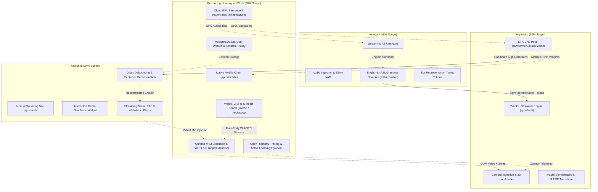
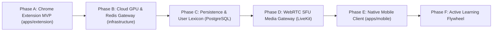

# Unassigned System Scope and Remaining Work Backlog

- **Tracking Location**: `docs/milestones/priyanshu/remaining-work.md`
- **Context**: Comprehensive inventory of architectural components, services, and features left out of the current three-member engineering assignments (Ashwani, Kanishka, Priyanshu).
- **Status**: Backlog / Unassigned
- **Total Project Allocation**: 28% of overall platform architecture

---

## Executive Summary

The primary three engineering tracks cover the core bidirectional communication loop (72% of total platform effort):
- **Ashwani (18%)**: Speech-to-Sign Model Pipeline (VAD, Streaming ASR, Grammar Transformation, Timing Tokens).
- **Kanishka (24%)**: Marketing Platform & Sign-to-Speech Application Pipeline (Sentence Reconstruction, Streaming TTS Playback).
- **Priyanshu (30%)**: Sign-to-Speech Model Pipeline (3D Landmarks, ST-GCN Recognition) & Speech-to-Sign Avatar Engine (WebGL 3D Rigging, Blendshapes, SLERP).

The remaining **28%** of the platform encompasses production distribution, conference calling integration, native mobile edge support, enterprise cloud infrastructure, persistence, and continuous telemetry.

---

## System Work Allocation and Architecture Topology

The diagram below illustrates the architectural seams between the assigned member domains and the remaining unassigned backlog:

---

## Work Breakdown and Effort Distribution Matrix

| Subsystem Component | Scope Description | Owner | Status | Project Weight (%) |
| :--- | :--- | :--- | :--- | :--- |
| **Vision Perception Model** | 3D landmarks, One-Euro filtering, ST-GCN on WLASL | Priyanshu | Assigned | 15% |
| **3D Avatar Engine** | WebGL canvas, skeletal rigging, ARKit blendshapes, SLERP | Priyanshu | Assigned | 15% |
| **ASR & Translation Model** | Silero VAD, streaming ASR, SVO to Topic-Comment, tokens | Ashwani | Assigned | 18% |
| **Marketing Experience** | Next.js landing page, interactive simulator, WCAG AAA | Kanishka | Assigned | 10% |
| **Sentence Reconstruction & Audio** | Debounced gloss smoothing, tense resolution, Web Audio TTS | Kanishka | Assigned | 14% |
| **Chrome Extension & VoIP HUD** | Manifest V3, Google Meet/Zoom DOM injection, virtual mic | Unassigned | Backlog | 10% |
| **WebRTC SFU Media Gateway** | LiveKit/mediasoup SFU, STUN/TURN traversal, RTP streaming | Unassigned | Backlog | 6% |
| **Native Mobile Clients** | React Native / Expo, CameraX/AVFoundation, CoreML/TFLite | Unassigned | Backlog | 8% |
| **Cloud GPU & Scaled Gateway** | Docker, Kubernetes, Triton/vLLM serving, Redis Pub/Sub | Unassigned | Backlog | 6% |
| **Persistence, Telemetry & Flywheel** | PostgreSQL schema, custom lexicon, OpenTelemetry, active learning | Unassigned | Backlog | 8% |
| **Total** | **Full Converse Platform Lifecycle** | **All Tracks** | **Mixed** | **100%** |

---

## Detailed Specifications of Remaining Work

### 1. Chrome Manifest V3 Extension and In-Meeting VoIP Overlay (`apps/extension/`)
- **Project Weight**: 10%
- **Objective**: Deliver a seamless video conference companion injecting Converse real-time capabilities directly into Google Meet, Zoom Web, and Microsoft Teams calls.
- **Architectural Seams and Core Components**:
  1. *DOM Video Frame Extractor*: Content script locating remote peer `<video>` elements in conference DOM, extracting raw video frames via offscreen canvas or MediaStreamTrackProcessor without degrading host call frame rates.
  2. *Virtual Microphone Injector*: Web Audio loopback hook routing Kanishka's synthesized neural TTS audio directly into the meeting microphone input stream so remote attendees hear the spoken interpretation.
  3. *Non-Intrusive Floating HUD Overlay*: Draggable, resizable transparent canvas overlay inside the active meeting tab displaying:
     - Real-time ASL glosses and reconstructed English subtitles.
     - Optional compact 3D avatar viewport (Priyanshu's avatar engine embedded in an iframe or web component).
  4. *Manifest V3 Service Worker Lifecycle*: Background worker managing persistent WebSocket connections with automatic reconnection, keep-alive alarms, and strict adherence to Chrome memory quotas.
- **Verification Criteria**:
  - Operates inside Google Meet with host tab frame rate staying $\ge 25\text{ FPS}$.
  - Memory consumption stays strictly flat across a continuous 45-minute call (<150MB heap).
  - Virtual microphone audio transmits cleanly without acoustic echo or feedback loops.

---

### 2. WebRTC SFU Media Gateway and NAT Traversal
- **Project Weight**: 6%
- **Objective**: Establish production multi-party real-time media infrastructure enabling low-latency video and audio transmission across diverse network topologies.
- **Architectural Seams and Core Components**:
  1. *Selective Forwarding Unit (SFU) Integration*: Evaluation and deployment of LiveKit or mediasoup to route video and audio streams between multiple signers and listeners.
  2. *Direct RTP / SRTP Ingestion*: Bypassing browser WebSocket overhead by sending raw media tracks directly into backend inference nodes.
  3. *STUN and TURN Relay Infrastructure*: Coturn cluster deployment ensuring reliable traversal through corporate firewalls, symmetric NATs, and restricted institutional networks.
  4. *Adaptive Bitrate (ABR) Controller*: Dynamically throttling video stream resolution and frame rate when network packet loss exceeds 5% to protect landmark extraction stability.
- **Verification Criteria**:
  - End-to-end media transport latency $\le 80\text{ms}$ under 50ms simulated network jitter.
  - Zero dropped sessions across symmetric NAT configurations via TURN relay fallback.

---

### 3. Native Mobile Client (`apps/mobile/`)
- **Project Weight**: 8%
- **Objective**: Build a cross-platform mobile application (iOS and Android) for in-person communication between Deaf signers and hearing peers in everyday physical environments.
- **Architectural Seams and Core Components**:
  1. *Framework & Hardware Ingestion*: React Native / Expo application utilizing native camera APIs (Android CameraX, iOS AVFoundation) for constant 30 FPS frame capture with zero frame drops.
  2. *Edge Model Compilation and Optimization*:
     - Exporting Priyanshu's landmark and ST-GCN models to CoreML (Apple Neural Engine) and TFLite / NNAPI (Android NPU).
     - Exporting Ashwani's ASR and grammar models to quantized ONNX Runtime Mobile or whisper.tflite.
  3. *Fully Offline Two-Way Mode*: Enabling two individuals to converse in remote or low-connectivity locations without requiring internet access.
  4. *Dual-Screen Viewport UX*: Split-screen mobile layout where one half displays the signer's camera and transcript, while the opposing half faces the hearing peer with synthesized voice output and microphone button.
- **Verification Criteria**:
  - Runs on iPhone 13+ and modern Qualcomm Snapdragon Android devices at $\ge 25\text{ FPS}$ sustained camera inference.
  - Thermal throttling does not trigger within 20 minutes of continuous on-device translation.

---

### 4. Cloud Infrastructure, GPU Inference Cluster, and Horizontal Gateway (`infrastructure/`, `services/api/`)
- **Project Weight**: 6%
- **Objective**: Productionize backend deployment to support hundreds of concurrent real-time bidirectional sessions with auto-scaling GPU compute.
- **Architectural Seams and Core Components**:
  1. *GPU Inference Cluster Orchestration*:
     - Containerized deployment using NVIDIA Triton Inference Server, vLLM, or Ray Serve for batched parallel model execution.
     - Dynamic GPU model multiplexing: Allocating GPU memory efficiently across ASR (Whisper), Vision (ST-GCN), and TTS (Piper).
  2. *Multi-Node WebSocket Gateway Clustering*:
     - Redis Pub/Sub cluster decoupling client connections from backend model workers.
     - Sticky session routing or stateless token passing across container instances.
  3. *Infrastructure as Code (IaC)*:
     - Terraform manifests for provisioning AWS EKS / GCP GKE clusters, GPU node groups (NVIDIA L4 / A10G), and Application Load Balancers.
     - Helm charts for reproducible staging and production deployments.
- **Verification Criteria**:
  - Cluster auto-scales from 1 to 10 GPU nodes within 3 minutes under simulated 500-session load spikes.
  - Zero dropped WebSocket messages during rolling pod deployments.

---

### 5. Persistence, User Identity, Telemetry, and Active Learning Flywheel
- **Project Weight**: 8%
- **Objective**: Establish long-term data persistence, personalized user customization, distributed observability, and an automated model improvement loop.
- **Architectural Seams and Core Components**:
  1. *Database Schema & Identity (`packages/contracts/src/database.ts`)*:
     - PostgreSQL database with Prisma / Drizzle ORM tracking user accounts, session history, saved conversation transcripts, and latency metrics.
     - Authentication via JWT, Clerk, or NextAuth with strict privacy isolation.
  2. *Personalized Vocabulary and Dialect Dictionaries*:
     - Allowing signers to configure custom sign shortcuts, technical vocabulary expansions, and regional dialect preferences (e.g., Black ASL / regional variations).
  3. *Distributed OpenTelemetry Latency Tracing*:
     - Spans injected across the entire loop: Camera Capture -> Landmark Extraction -> Vision Inference -> Reconstructor -> ASR -> Translation -> Avatar / TTS Playback.
     - Automated detection of latency bottlenecks and packet drops.
  4. *Active Learning Data Flywheel*:
     - Signer correction UI: Allowing Deaf users to flag misclassified signs with one click.
     - Secure, opt-in landmark recording submission for continuous retraining of Priyanshu's ST-GCN model without storing raw RGB video frames (preserving complete user privacy).
- **Verification Criteria**:
  - Database migrations execute cleanly with zero downtime.
  - Distributed trace spans capture 100% of end-to-end sessions with sub-millisecond precision.
  - Anonymized landmark feedback ingestion complies with HIPAA and GDPR data privacy standards.

---

## Sequencing and Recommended Implementation Phases

If engineering resources become available, the remaining backlog should be prioritized in the following sequence:

1. **Phase A (Chrome Extension MVP)**: Directly unlocks video calling (Google Meet/Zoom) for hackathon demo impact.
2. **Phase B (Cloud GPU & Redis Gateway)**: Scales backend to survive live multi-user evaluations.
3. **Phase C (Persistence & Custom Lexicon)**: Adds user accounts and personalized sign dictionaries.
4. **Phase D (WebRTC SFU Media Gateway)**: Upgrades transport from WebSockets to production media streams.
5. **Phase E (Native Mobile Client)**: Brings the communication engine to handheld devices for in-person use.
6. **Phase F (Active Learning Flywheel)**: Closes the machine learning loop for continuous model improvement.
