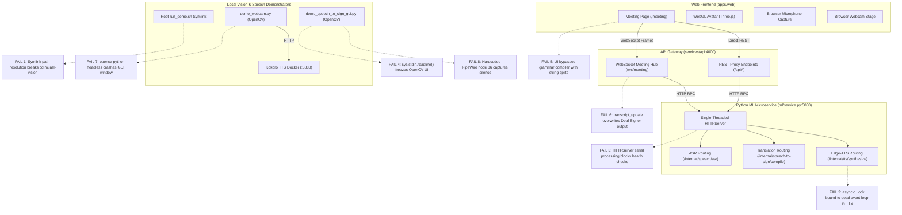
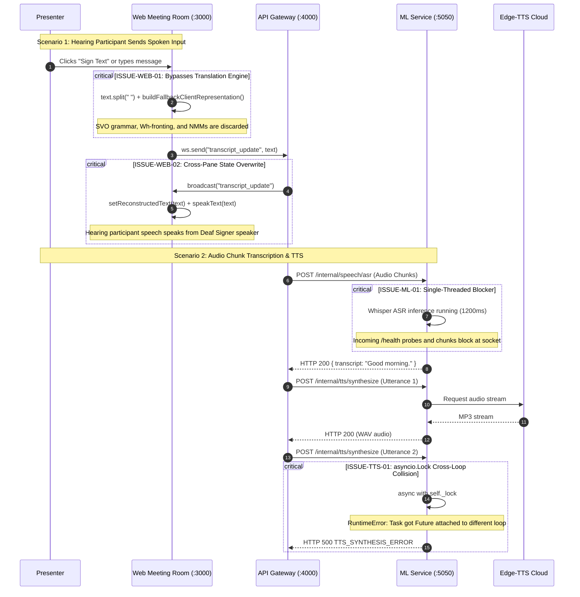

# Converse Pre-Demo Technical Issues & Architectural Audit

This document catalogues all persistent technical issues, architectural bottlenecks, runtime failure points, and cross-boundary inconsistencies across the Converse repository prior to live demonstration.

---

## 1. System Architecture & Critical Failure Points

The following diagram maps the end-to-end dataflow between the Web Frontend, API Gateway, Python Model Services, and Hardware Subsystems, highlighting points where uncaught exceptions or design flaws break pipeline execution.



---

## 2. Severity Matrix

| Priority | Identifier | Component | Failure Condition | Demo Impact |
|---|---|---|---|---|
| **P0** | ISSUE-DEMO-01 | [`run_demo.sh`](file:///home/user/converse/run_demo.sh) | Symlink resolves `REPO_ROOT` to `/home/user` | Script aborts immediately on execution |
| **P0** | ISSUE-TTS-01 | [`ml/tts/src/converse_tts/engine.py`](file:///home/user/converse/ml/tts/src/converse_tts/engine.py) | `asyncio.Lock` re-used across ephemeral event loops | Second TTS call crashes with HTTP 500 |
| **P0** | ISSUE-ML-01 | [`ml/service.py`](file:///home/user/converse/ml/service.py) | Single-threaded `HTTPServer` | Inference blocks all concurrent requests and `/health` |
| **P0** | ISSUE-GUI-01 | [`scripts/demo_speech_to_sign_gui.py`](file:///home/user/converse/scripts/demo_speech_to_sign_gui.py) | `sys.stdin.readline()` on OpenCV thread | Window freezes with OS "Not Responding" dialog |
| **P1** | ISSUE-WEB-01 | [`apps/web/app/meeting/page.tsx`](file:///home/user/converse/apps/web/app/meeting/page.tsx) | `handleSendSpeech` uses space split, not backend API | Grammar compiler and NMMs bypassed in web app |
| **P1** | ISSUE-WEB-02 | [`apps/web/app/meeting/page.tsx`](file:///home/user/converse/apps/web/app/meeting/page.tsx) | `transcript_update` bound to `setReconstructedText` | Hearing speech overwrites Deaf Signer transcription |
| **P1** | ISSUE-MIC-01 | [`scripts/run_speech_demo.sh`](file:///home/user/converse/scripts/run_speech_demo.sh) | Hardcoded PipeWire node `86` and sound card `2` | Microphone streams silence on non-host machines |
| **P1** | ISSUE-VIS-01 | [`ml/asl-vision/pyproject.toml`](file:///home/user/converse/ml/asl-vision/pyproject.toml) | `opencv-python-headless` declared in dependencies | Window creation crashes with unhandled `cv2.error` |
| **P1** | ISSUE-CAM-01 | [`ml/asl-vision/scripts/demo_webcam.py`](file:///home/user/converse/ml/asl-vision/scripts/demo_webcam.py) | Unhandled `cv2.VideoCapture` failure | Aborts with `RuntimeError` if camera 0 is unavailable |
| **P1** | ISSUE-ML-02 | [`ml/service.py`](file:///home/user/converse/ml/service.py) | `all_events[-1].text` reads only final segment | First sentences discarded in multi-sentence audio |
| **P2** | ISSUE-WEB-03 | [`apps/web/components/avatar/webgl-avatar.tsx`](file:///home/user/converse/apps/web/components/avatar/webgl-avatar.tsx) | `useEffect` recreates Three.js scene on speed change | GPU memory leak and canvas flashing |
| **P2** | ISSUE-REC-01 | [`ml/asl-vision/scripts/demo_webcam.py`](file:///home/user/converse/ml/asl-vision/scripts/demo_webcam.py) | Unconditional `subj` overwriting on pronouns | Meaning inverted: "I SEE YOU" becomes "You see." |
| **P2** | ISSUE-MIC-02 | [`scripts/demo_speech_to_sign_gui.py`](file:///home/user/converse/scripts/demo_speech_to_sign_gui.py) | `arecord` hardcoded to stereo (`-c 2`) | 100% CPU infinite crash loop on mono microphones |
| **P2** | ISSUE-AV-01 | [`apps/web/components/avatar/webgl-avatar.tsx`](file:///home/user/converse/apps/web/components/avatar/webgl-avatar.tsx) | Double interpolation during lead-out and lead-in | Sign avatar stutters or freezes between tokens |

---

## 3. Sequence Flow & Failure Scenarios

### Speech-to-Sign Pipeline Runtime Failures



---

## 4. Subsystem Vulnerability Catalog

### 4.1. Web Frontend (`apps/web`)

#### ISSUE-WEB-01: Hearing Participant Input Bypasses Translation Engine
- **File**: [`apps/web/app/meeting/page.tsx#L467-L504`](file:///home/user/converse/apps/web/app/meeting/page.tsx#L467-L504)
- **Problem**: When typing a phrase or selecting a sample prompt, `handleSendSpeech()` splits English text on whitespace (`textToTranslate.toUpperCase().replace(/[^A-Z\s]/g, "").split(/\s+/)`) and tags each word with `pos: "NOUN"`. It calls a local client mock `buildFallbackClientRepresentation()` rather than dispatching to `/api/speech-to-sign/translate`.
- **Impact**: All natural language ASL translation capabilities (Subject-Verb-Object to Topic-Comment, Wh-question end-movement, clausal negation, eyebrow furrow/raise, and 3D spatial loci) fail to execute in the web application.
- **Fix**:
  ```typescript
  const response = await fetch("/api/speech-to-sign/translate", {
    method: "POST",
    headers: { "Content-Type": "application/json" },
    body: JSON.stringify({ englishText: textToTranslate }),
  });
  const data = await response.json();
  if (data.representation) {
    setAvatarRepresentation(data.representation);
    setAslTokens(data.aslTokens.map((t: any) => ({
      gloss: t.gloss,
      pos: t.partOfSpeech,
      marker: `EYEBROWS: ${t.nonManualMarkers.eyebrows.toUpperCase()}`,
    })));
  }
  ```

#### ISSUE-WEB-02: `transcript_update` Broadcast Overwrites Deaf Signer UI Pane
- **File**: [`apps/web/app/meeting/page.tsx#L219-L228`](file:///home/user/converse/apps/web/app/meeting/page.tsx#L219-L228)
- **Problem**: The WebSocket handler routes `transcript_update` directly into `setReconstructedText()` and triggers `speakText()`. `reconstructedText` is the state displayed inside the **Left Pane (Local Deaf Signer)**.
- **Impact**: When the hearing participant speaks or sends a phrase, the text appears in the Deaf Signer's output container and automatically speaks back to the user via browser speech synthesis.
- **Fix**: Direct `transcript_update` to `setSpeechTranscript()` when the update represents hearing speech, and restrict `setReconstructedText()` to messages where `direction === "sign_to_speech"`.

#### ISSUE-WEB-03: WebGL Scene Destruction and Context Leaks on Playback Speed Toggle
- **File**: [`apps/web/components/avatar/webgl-avatar.tsx#L508-L726`](file:///home/user/converse/apps/web/components/avatar/webgl-avatar.tsx#L508-L726) and [`apps/web/components/avatar/webgl-avatar.tsx#L949`](file:///home/user/converse/apps/web/components/avatar/webgl-avatar.tsx#L949)
- **Problem**: `playbackSpeed` is listed as a dependency of the Three.js scene setup `useEffect`. When clicking `0.75x`, `1.0x`, or `1.5x`, the cleanup function executes `renderer.dispose()` and strips the DOM element, but fails to call `.dispose()` on geometries and materials (`torsoGeometry`, `headGeometry`, `skinMaterial`, etc.).
- **Impact**: Noticeable UI hitching, frame dropping, and eventual WebGL context loss errors in Chromium.
- **Fix**: Move `playbackSpeed` into a ref (`playbackSpeedRef.current = playbackSpeed`) accessed inside the `requestAnimationFrame` loop, and remove it from the effect dependency array.

#### ISSUE-WEB-04: Avatar Pose Animation Stutter on Sign Transitions
- **File**: [`apps/web/components/avatar/webgl-avatar.tsx#L774-L794`](file:///home/user/converse/apps/web/components/avatar/webgl-avatar.tsx#L774-L794)
- **Problem**: In Phase 3 (`elapsedMs < totalTokenDuration`), the pose interpolates toward `nextTargetPose`. When the token completes, `previousPoseRef.current` is updated to this position. In the next frame, Phase 1 (`elapsedMs < leadInMs`) interpolates again from `previousPoseRef.current` to `targetPose`.
- **Impact**: The avatar holds a rigid pause between signs rather than articulating fluidly.
- **Fix**: Interpolate toward neutral rest or omit Phase 3 blending when Phase 1 lead-in handles cross-token transition.

---

### 4.2. Backend Gateway & WebSocket Hub (`services/api`)

#### ISSUE-API-01: Silent Fallback Injects Hardcoded String on Transcription Failure
- **File**: [`services/api/src/realtime.ts#L399-L403`](file:///home/user/converse/services/api/src/realtime.ts#L399-L403)
- **Problem**: When `transcribeSpeech()` encounters an HTTP error, socket timeout, or non-responsive Python ML service, the gateway executes:
  ```typescript
  transcriptText = "Hello, welcome to our meeting.";
  ```
- **Impact**: When actual speech fails to transcribe or silence is sent, the gateway emits a false "Hello, welcome to our meeting." transcript, confusing presenters.
- **Fix**: Send a typed `RealtimeErrorPayload` with code `ASR_PROCESSING_FAILED` and do not emit a synthetic transcript.

#### ISSUE-API-02: WebSocket `transcript_update` Events Are Not Translated
- **File**: [`services/api/src/realtime.ts#L474-L487`](file:///home/user/converse/services/api/src/realtime.ts#L474-L487)
- **Problem**: The gateway only broadcasts raw `transcript_update` envelopes across room clients. It never forwards the text to `translateSpeechToSign()` to obtain tokens or 3D spatial representations.
- **Impact**: Submitting transcripts via WebSocket does not produce sign language representations.
- **Fix**: Call `translateSpeechToSign()` on incoming text updates and broadcast a `translation_result` envelope containing the compiled `SignRepresentation`.

---

### 4.3. Python ML Microservice & Speech Subsystems (`ml/`)

#### ISSUE-ML-01: Single-Threaded `HTTPServer` Serializes All Workloads
- **File**: [`ml/service.py#L6-7`](file:///home/user/converse/ml/service.py#L6-L7) and [`ml/service.py#L308-L316`](file:///home/user/converse/ml/service.py#L308-L316)
- **Problem**: `ModelServiceHandler` runs under `http.server.HTTPServer`. Because Python's default `HTTPServer` processes requests serially, any CPU-bound task (Faster-Whisper INT8 inference or Edge-TTS network roundtrip) completely blocks the server thread.
- **Impact**: Health checks (`/health`) time out, concurrent audio chunk streaming stalls, and client WebSocket connections drop.
- **Fix**:
  ```python
  from http.server import ThreadingHTTPServer

  def run_server(port: int = 5050) -> None:
      server = ThreadingHTTPServer(("127.0.0.1", port), ModelServiceHandler)
      server.serve_forever()
  ```

#### ISSUE-ML-02: Multi-Sentence Spoken Transcripts Discarded
- **File**: [`ml/service.py#L144-L149`](file:///home/user/converse/ml/service.py#L144-L149) and [`ml/service.py#L232-L238`](file:///home/user/converse/ml/service.py#L232-L238)
- **Problem**: In both `_handle_asr` and `_handle_audio_to_sign`, the final transcript extraction reads:
  ```python
  if all_events:
      last = all_events[-1]
      final_transcript = last.text
  ```
- **Impact**: When a speaker speaks two complete clauses ("Hello everyone. Let us begin the demo."), VAD emits multiple events. Only the final clause is preserved; earlier clauses are lost.
- **Fix**: Concatenate all completed segments: `final_transcript = " ".join(e.text for e in all_events if e.is_final)`.

#### ISSUE-ML-03: Per-Request Model Reloading and GPU/CPU Memory Leak
- **File**: [`ml/service.py#L37-41`](file:///home/user/converse/ml/service.py#L37-L41)
- **Problem**: Calling `ModelServiceHandler.get_engine(backend_override)` invokes `create_asr_engine(backend=backend_override)` whenever `backend` is present in the payload. In [`ml/asr/src/asr/engine.py#L464`](file:///home/user/converse/ml/asr/src/asr/engine.py#L464), this instantiates a new `FasterWhisperBackend`, reading weights from disk and allocating new memory structures on every invocation.
- **Impact**: Latency surges by 3-8 seconds per chunk, followed by an Out-Of-Memory process termination.
- **Fix**: Cache model instances in a dictionary keyed by backend name.

#### ISSUE-ML-04: Unhandled Query Strings Lead to 404 Not Found
- **File**: [`ml/service.py#L65`](file:///home/user/converse/ml/service.py#L65) and [`ml/service.py#L84-L97`](file:///home/user/converse/ml/service.py#L84-L97)
- **Problem**: Endpoints check `self.path` via exact matching (e.g. `self.path == "/internal/tts/synthesize"`). Query strings in `self.path` (such as `?format=wav`) cause comparisons to fail.
- **Impact**: Any client passing URL parameters receives `404 Not Found`.
- **Fix**: Strip query parameters using `path = self.path.split("?")[0]`.

---

### 4.4. Neural Voice Synthesis Engine (`ml/tts/`)

#### ISSUE-TTS-01: Cross-Loop `asyncio.Lock` Crash in `EdgeTtsEngine`
- **File**: [`ml/tts/src/converse_tts/engine.py#L52`](file:///home/user/converse/ml/tts/src/converse_tts/engine.py#L52) and [`ml/tts/src/converse_tts/engine.py#L298-L309`](file:///home/user/converse/ml/tts/src/converse_tts/engine.py#L298-L309)
- **Problem**: `EdgeTtsEngine.__init__` creates `self._lock = asyncio.Lock()`. In synchronous environments (`synthesize_sync`), it runs `asyncio.run(self.synthesize(...))`. Each `asyncio.run` creates and destroys an event loop. On the second invocation, `async with self._lock` attempts to acquire a lock bound to the destroyed loop.
- **Impact**:
  ```text
  RuntimeError: Task <Task pending ...> got Future <Future pending ...> attached to a different loop
  ```
  The first TTS call works; all subsequent TTS requests fail with HTTP 500.
- **Fix**: Replace `asyncio.Lock()` with a standard `threading.Lock()` for cache protection, or instantiate `self._lock` inside the active loop.

#### ISSUE-TTS-02: Corrupted Duration Calculation for MP3 Audio Payloads
- **File**: [`ml/service.py#L272-L283`](file:///home/user/converse/ml/service.py#L272-L283)
- **Problem**: Non-PCM formats execute:
  ```python
  pcm_len = max(0, len(audio_bytes) - 44) if len(audio_bytes) >= 44 else 0
  duration_ms = EdgeTtsEngine.calculate_duration_ms(pcm_len, sample_rate=self.tts_engine.sample_rate)
  ```
  `calculate_duration_ms` assumes 16-bit uncompressed PCM (32,000 bytes/sec). For compressed MP3, this formula underestimates the true duration by roughly 10x.
- **Impact**: Inaccurate `X-Audio-Duration-Ms` headers desynchronize client subtitles and visual playback.
- **Fix**: Calculate MP3 duration from decoded PCM byte length before container encoding.

---

### 4.5. ASL Grammar Compiler & Linguistic Rules (`ml/translation/`)

#### ISSUE-TRANS-01: Sentence-Initial Capitalized Words Misclassified as Proper Nouns
- **File**: [`ml/translation/src/translation/grammar_rules.py#L7664-L7669`](file:///home/user/converse/ml/translation/src/translation/grammar_rules.py#L7664-L7669)
- **Problem**: In `parse_word`:
  ```python
  elif clean_word and clean_word[0].isupper() and (not is_sentence_start or lower not in COMMON_NOUNS):
      pos = "PROPN"
  ```
  Any sentence-starting capitalized word that is not in the small `COMMON_NOUNS` set is classified as a proper noun.
- **Impact**: Common verbs starting a sentence ("Drink water", "Call me") are classified as proper nouns, triggering spatial referent indexing and letter-by-letter fingerspelling (`D-R-I-N-K`).
- **Fix**: Verify sentence-initial words against the general ASL lexicon before assigning `PROPN`.

#### ISSUE-TRANS-02: Compound Gloss Hyphen Stripping Corrupts Timing
- **File**: [`ml/translation/src/translation/fingerspelling.py#L2656-L2660`](file:///home/user/converse/ml/translation/src/translation/fingerspelling.py#L2656-L2660)
- **Problem**: `re.sub(r"[^A-Z0-9]", "", cleaned)` strips hyphens from compound glosses (`THANK-YOU`, `SEE-LATER`), merging characters into a continuous string without boundary delays.
- **Impact**: Compound signs fingerspell as an unbroken sequence without word spacing.
- **Fix**: Split hyphenated compounds into separate tokens before resolving fingerspelling.

---

### 4.6. ASL Vision & Perception Engine (`ml/asl-vision/`)

#### ISSUE-VIS-01: `opencv-python-headless` Breaks GUI Window Creation
- **File**: [`ml/asl-vision/pyproject.toml#L17`](file:///home/user/converse/ml/asl-vision/pyproject.toml#L17)
- **Problem**: The project requires `opencv-python-headless>=5.0.0.93`. Headless wheels omit Qt/GTK windowing bindings.
- **Impact**: Calling `cv2.namedWindow` ([`demo_webcam.py#L1095`](file:///home/user/converse/ml/asl-vision/scripts/demo_webcam.py#L1095)) raises `cv2.error: The function is not implemented`. The webcam demo cannot run in environments created from this lockfile.
- **Fix**: Change dependency to `opencv-contrib-python>=5.0.0.93`.

#### ISSUE-VIS-02: Unhandled Camera Open Failure
- **File**: [`ml/asl-vision/scripts/demo_webcam.py#L1080-L1083`](file:///home/user/converse/ml/asl-vision/scripts/demo_webcam.py#L1080-L1083)
- **Problem**: If camera index 0 cannot be opened, the script unconditionally raises `RuntimeError`.
- **Impact**: Running on laptops with external webcams at index 1 or in environments without `/dev/video0` crashes immediately, preventing presenters from using keyboard scenario injection [1-8].
- **Fix**: If index 0 fails, attempt index 1, and fall back to a virtual canvas for scenario injection.

#### ISSUE-VIS-03: Pronoun Inversion in ASL-to-English Reconstruction
- **File**: [`ml/asl-vision/scripts/demo_webcam.py#L743-L756`](file:///home/user/converse/ml/asl-vision/scripts/demo_webcam.py#L743-L756)
- **Problem**: `reconstruct_sentence` scans all tokens and updates `subj` on every pronoun found. If an object pronoun follows a verb (`["I", "SEE", "YOU"]`), `YOU` overwrites `subj`.
- **Impact**: Signing "I SEE YOU" reconstructs as "You see.", reversing the subject and object.
- **Fix**: Lock `subj` once a verb is identified, treating trailing pronouns as objects.

#### ISSUE-VIS-04: Redundant TGCN Model Instantiation and Double Inference
- **File**: [`ml/asl-vision/src/asl_vision/engine.py#L280-L320`](file:///home/user/converse/ml/asl-vision/src/asl_vision/engine.py#L280-L320) vs [`ml/asl-vision/scripts/demo_webcam.py#L1173-L1193`](file:///home/user/converse/ml/asl-vision/scripts/demo_webcam.py#L1173-L1193)
- **Problem**: `ASLVisionEngine` loads `tgcn_asl100.bin` into memory, while `demo_webcam.py` separately instantiates `TGCNWLASLClassifier` with the same weights. Both models run forward passes on the same frame buffer.
- **Impact**: Inference load is duplicated, halving FPS and causing noticeable frame drops.
- **Fix**: Consume predictions directly from `ASLVisionEngine`.

---

### 4.7. Demo Launchers & OS Hardware Scripts (`scripts/`)

#### ISSUE-DEMO-01: Root `run_demo.sh` Symlink Path Resolution Bug
- **File**: [`run_demo.sh#L16-L18`](file:///home/user/converse/scripts/run_demo.sh#L16-L18) and [`run_demo.sh#L290`](file:///home/user/converse/scripts/run_demo.sh#L290)
- **Problem**: Root `run_demo.sh` is a symlink pointing to `scripts/run_demo.sh`. When executed as `./run_demo.sh`, `SCRIPT_DIR` evaluates to `/home/user/converse`. `REPO_ROOT="$(cd "$SCRIPT_DIR/.." && pwd)"` evaluates to `/home/user`. At line 290, `cd "$ML_DIR"` attempts to enter `/home/user/ml/asl-vision` (which does not exist) and immediately aborts due to `set -e`.
- **Impact**: Running `./run_demo.sh` from the repository root fails instantly.
- **Fix**: Resolve symlinks using `readlink -f "$0"`:
  ```bash
  REAL_SCRIPT="$(readlink -f "${BASH_SOURCE[0]}")"
  SCRIPT_DIR="$(cd "$(dirname "$REAL_SCRIPT")" && pwd)"
  REPO_ROOT="$(cd "$SCRIPT_DIR/.." && pwd)"
  ```

#### ISSUE-DEMO-02: Hardcoded PipeWire Audio Node in `run_speech_demo.sh`
- **File**: [`scripts/run_speech_demo.sh#L39-L47`](file:///home/user/converse/scripts/run_speech_demo.sh#L39-L47)
- **Problem**: Contains developer-specific hardware IDs:
  ```bash
  wpctl set-default 86 2>/dev/null || true
  amixer -c 2 set 'Internal Mic Boost',0 1 2>/dev/null || true
  ```
- **Impact**: Directs PipeWire to an invalid node ID on other machines, capturing silence during live speech input.
- **Fix**: Remove hardcoded node `86` and sound card `2` commands.

#### ISSUE-DEMO-03: Blocking `sys.stdin.readline()` Freezes Speech-to-Sign GUI
- **File**: [`scripts/demo_speech_to_sign_gui.py#L1020-L1025`](file:///home/user/converse/scripts/demo_speech_to_sign_gui.py#L1020-L1025)
- **Problem**: Pressing `T` triggers `user_line = sys.stdin.readline().strip()` directly on the main OpenCV UI thread.
- **Impact**: The OpenCV window freezes, ceases rendering frames, stops processing key events, and is marked as "Not Responding" by the desktop environment until text is submitted in the hidden console.
- **Fix**: Run terminal input collection on a separate daemon thread.

#### ISSUE-DEMO-04: Rigid Stereo `arecord` Crashes on Mono Microphones
- **File**: [`scripts/demo_speech_to_sign_gui.py#L441-L458`](file:///home/user/converse/scripts/demo_speech_to_sign_gui.py#L441-L458)
- **Problem**: The ALSA fallback specifies `arecord ... -c 2`. Internal laptop microphones that support only mono (1-channel) capture fail immediately with `Channels count non available`.
- **Impact**: The streamer loop repeatedly respawns the failing process, entering an infinite loop that consumes 100% CPU while capturing zero audio.
- **Fix**: Detect channel allocation failure and retry with `-c 1`.

---

## 5. Pre-Demo Triage & Verification Checklist

To ensure operational stability during the live presentation, execute the following verification steps:

- [ ] **Step 1: Test Root Runner Script**
  ```bash
  # Must resolve REPO_ROOT correctly and start services without path aborts
  ./scripts/run_demo.sh --help
  ```
- [ ] **Step 2: Verify Single-Thread vs Multi-Thread ML Service**
  ```bash
  # Verify concurrent health checks respond during an active synthesis call
  curl -s http://127.0.0.1:5050/health &
  curl -s -X POST http://127.0.0.1:5050/internal/tts/synthesize \
    -H "Content-Type: application/json" \
    -d '{"text": "Testing synthesis latency"}'
  ```
- [ ] **Step 3: Test Repeated TTS Synthesis (asyncio.Lock check)**
  ```bash
  # Execute two consecutive requests to confirm the event loop does not crash
  curl -s -X POST http://localhost:4000/api/speech/tts \
    -H "Content-Type: application/json" -d '{"text": "First utterance"}'
  curl -s -X POST http://localhost:4000/api/speech/tts \
    -H "Content-Type: application/json" -d '{"text": "Second utterance"}'
  ```
- [ ] **Step 4: Verify Web Meeting Room Speech Translation**
  ```bash
  # Confirm the grammar compiler produces ASL tokens from English text
  curl -s -X POST http://localhost:4000/api/speech-to-sign/translate \
    -H "Content-Type: application/json" \
    -d '{"englishText": "What is your name?"}'
  ```
- [ ] **Step 5: Verify Camera and Hotkey Fallback**
  ```bash
  # Confirm GUI initializes and processes scenario hotkeys [1-8] even without /dev/video0
  uv run --directory ml/asl-vision python scripts/demo_webcam.py --help
  ```
- [ ] **Step 6: Confirm Audio Capture Device Selection**
  ```bash
  # Ensure default microphone node is valid and unmuted
  wpctl status
  ```
- [ ] **Step 7: Verify Clean Builds and Type Integrity**
  ```bash
  pnpm check-types && pnpm lint && pnpm build
  ```
